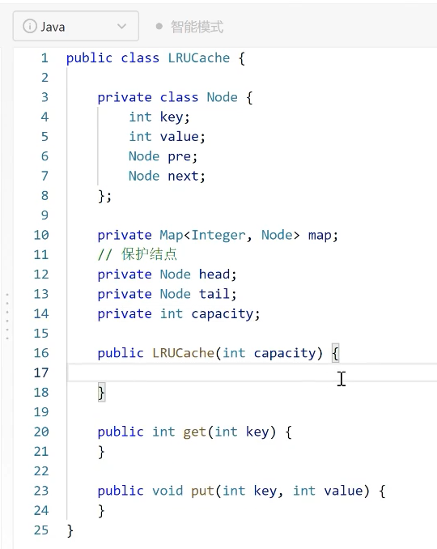
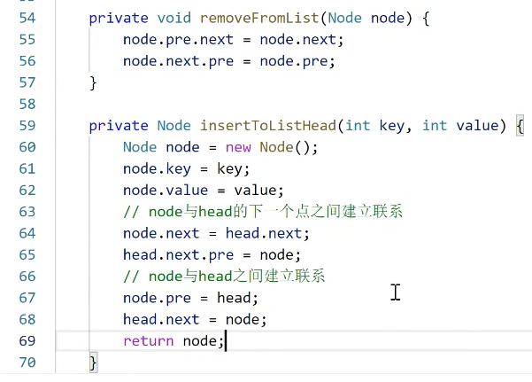

# Thins to remember/review:

- 写一个程序，不用管从那开始，想到啥先写啥，把所有relevant information先写上去，不会代码就写思路，思路清晰之后在考虑具体实现的代码。==》loop是要考虑每一步该如何走，往哪走，你的终止条件是什么？变化的信息/state有哪些？要收集的信息有哪些？最后在哪里返回？

- What make a good hashTable?

  - 好的哈希函数有两个特点：简单，均匀性。所谓<u>简单就是可以很快地产生一个较好的 hash 值</u>，<u>均匀性是指所有的数据可以均匀地映射到各个 hash 值上，避免产生大部分数据映射到少数的 hash 值上</u>。开散列法表头数组变大，冲突可能性会降低，因为可以映射到的组变多了。开散列法的哈希表删除元素与插入操作类似。

- 如何实现一个可变长数组？请你设计一个class，支持末尾插入，末尾删除，访问第i个元素，问实现方法要求能支持Indexing and随机访问.
  - 分配多长的连续空间？
    - 空数组，分配常数空间
  - Push back空间不够用怎么处理？
    - 申请2倍大小连续空间 >> 拷贝 >> 销毁原对象 >> 释放旧空间
  - Pop back空间剩余很多如何收回？
    - 如果空间利用率不到25%（也就是75%都没用到），释放一半的空间
  
- Two pointer array 题的模板:

  ```python
  class Solution:
      def removeDuplicates(self, nums: List[int]) -> int:
          """
              Input: nums = [0,0,1,1,1,2,2,3,3,4]
              Output: 5, nums = [0,1,2,3,4,_,_,_,_,_]
              Explanation: Your function should return k = 5, with the first five elements of nums being 0, 1, 2, 3, and 4 respectively. It does not matter what you leave beyond the returned k (hence they are underscores).
          """
          # 思考1: 什么时候要这个数？==》1)当它和前面的数不一样的时候，2)当它是第一个数时
          # 思考2：如果时in-place, 这array可不可以覆盖，什么时候可以？==》这个题可以覆盖，因为n的位置是永远less than or equal to i 的
          n = 0   # 跟踪最后一个valid的数。 
          for i in range(len(nums)):
              if i==0 or nums[i] != nums[i-1]: # 第一个肯定要。（不同的题，条件会不一样
                  nums[n] = nums[i]
                  n += 1
          return n
  ```
  
- 88.Merge Sorted Array:

  ```python
  class Solution:
      def merge(self, nums1: List[int], m: int, nums2: List[int], n: int) -> None:
          p1, p2 = m-1, n-1
          i=m+n-1
          while p1>=0 or p2>=0: # Traver from tail to the head
              if p2<0 or (p1>=0 and nums1[p1]>nums2[p2]):
                  nums1[i] = nums1[p1]
                  p1-=1
              else:
                  nums1[i] = nums2[p2]
                  p2-=1
              i-=1
  ```
  
  https://leetcode-cn.com/problems/merge-sorted-array/
  
- How to traverse over a linked list?

  ```python
  # 遍历链表：
  while head:
      head = head.next # 如果需要更改，新建一个指针暂存
  ```

- When you need to create/add a protectNode?

  - When you need to return the head

  ```python
  ListNode protect = new ListNode(0, head); # return protect.next
  ```

- What mechanism Python is using for function passing? and what is pass by sharing?

  - What is pass by sharing in Python:  ==> 简单来说就是下图。它和 ”copy-by-value” and “copy by reference” 都不一样。C是”copy-by-value”，当pointer被pass to caller, an exact copy will be created. However, in python, it’s using “copy by sharing”, so a new address/reference will be created.  More details refers to this, https://www.python-course.eu/python3_passing_arguments.php
  - 

- 遇事不决先枚举, 然后画图。。。

- for, while loop枚举时，access array index时，都要注意处理考虑越界的情况

- 程序如果看不懂，直接打印log出来，看都干了啥

- 双向链表的优缺点是什么？如何弥补？

  - ==》优点是可以快速insert and delete, 只需O(1)
  - ==》缺点是无法快速访问，需要O(n) 
  - ==> 弥补方法是通过数组或者哈希表建立一个映射的关系
  
- How to start with a double linked list?

  - 

- How to implement insert() and delete() in DLL?
  - 

- 做题时，要注意关注其中==**动态变化的**==数据 （题目给的那些数据是不会变的)

- How to write a customized sorting algorithm?

```python
# 消耗(actual)小，门槛（minimum）大，是先做的条件、按actual + (-minimum)排序
tasks.sort(key=lambda list: list[0]-list[1])
```

Reference, https://stackoverflow.com/questions/11850425/custom-python-list-sorting

- How to implement Python \_\_lt\_\_ and \_\_gt\_\_ custom overloaded operator?

```python
class distance:
  def __init__(self, x=5,y=5):
    self.ft=x
    self.inch=y

  def __eq__(self, other):
    if self.ft==other.ft and self.inch==other.inch:
      return "both objects are equal"
    else:
      return "both objects are not equal"

  def __lt__(self, other):
    in1=self.ft*12+self.inch
    in2=other.ft*12+other.inch
    if in1<in2:
      return "first object smaller than other"
    else:
      return "first object not smaller than other"

  def __gt__(self, other):
    in1=self.ft*12+self.inch
    in2=other.ft*12+other.inch
    if in1<in2:
      return "first object greater than other"
    else:
      return "first object not greater than other"

d1=distance(5,5)
d2=distance()
print (d1>d2)
d3=distance()
d4=distance(6,10)
print (d1<d2)
d5=distance(3,11)
d6=distance()
print(d5<d6)
```

Reference， https://www.tutorialspoint.com/How-to-implement-Python-lt-gt-custom-overloaded-operators


## Python Tricks

- Converting a list of list to a list of tuple:

e.g., [[x1, y1], [x2, y2]] ==> {(x1, y1), (x2, y2)} 

```python
obstacleSet = set(map(tuple, obstacles))
```

https://leetcode-cn.com/problems/walking-robot-simulation/

- How to sort a list of string?

e.g., “bcda” ==> “abcd”

```python
 str = "bcda"
''.join(sorted(str))
```

Reference: 1)Offical Doc, https://docs.python.org/3/library/collections.html#, 2)GeekForGeek, https://www.geeksforgeeks.org/defaultdict-in-python/, 3) Programiz, https://www.programiz.com/python-programming/methods/built-in/sorted

- dict() vs Collections.defaultdict(list)

a Python dictionary throws a `KeyError` if you try to get an item with a key that is not currently in the dictionary.

However, the `defaultdict` in contrast will simply create any items that you try to access (provided of course they do not exist yet). In this case, default items are created using `list()`, which returns a new empty list object.

- Converting between Dict() and list()

```python
dict1 = {'name': 'Ravi', 'age': 23, 'marks': 56}
# Dict ==> List: [('name', 'Ravi'), ('age', 23), ('marks', 56)]
list1 = list(d1.items())
# List ==> Dict: {'name': 'Ravi', 'age': 23, 'marks': 56}
dict2 = dict(a)
    

```


Reference： 1) Stack Overflow, [How does collections.defaultdict work?](https://stackoverflow.com/questions/5900578/how-does-collections-defaultdict-work)

### Python Data Structure

- Set
- Tuple
- List, Array, Queue, Stack
- Dict, Maps, Hash Tables
- Reference
  - Offical Doc, https://docs.python.org/3/tutorial/datastructures.html
  - 菜鸟教程, https://www.runoob.com/python3/python3-data-structure.html

