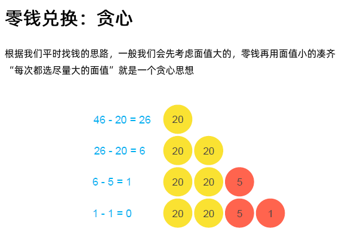
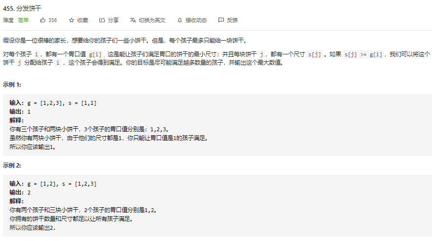
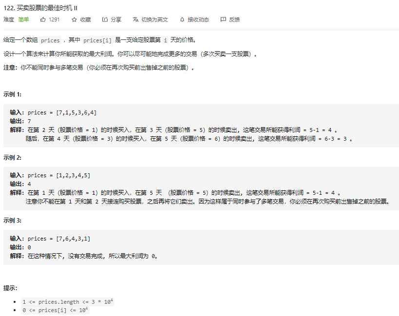
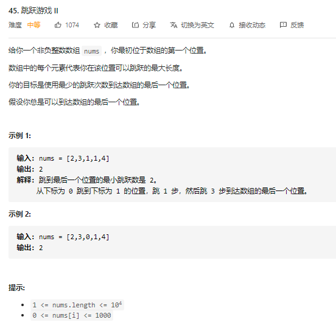

[TOC]

# Outline

- 贪心理论与常见的证明方法
- 贪心题目实战


# 贪心算法知识点

- 在每一步选择中，都采取在当前状态下的最有决策(**局部最优)**， 但我们希望由此导致的最终结果是全局最优的
- 他与只有要讲的动态规划相比，不同之处在于：他<u>不对整个状态空间遍历搜索</u>，而是始终按照局部最优的选择方法，执行下去，不回头（就有点像dfs，只要找当前path的最优解) ==> 正因为这个特性，贪心算法<u>不一定能得到正确的结果</u> 
- ==》所以在使用贪心前，一定要先证明其正确性，e.g., 反证法，数学归纳法，决策包容性(搜索空间包含最优解空间，只要证明搜索路径会包含最优解，就可以用)
  - 
- 但为什么还要讲贪心算法呢？ ==》因为它不考虑未来，所以<u>效率高</u>，有一些场景可能会比较实用。就像人一样，我们做得每个决定不会有太多时间去想的，谁知道未来，都是考虑当前状态的最决战，所以我们做得很多决定都不可能是全局最优的


# 贪心实战例题

## [零钱兑换](https://leetcode-cn.com/problems/coin-change/)（Medium）

- [零钱兑换](https://leetcode-cn.com/problems/coin-change/)（Medium）半年内出题频次：

| Facebook | 字节跳动 | 微软 | Amazon |
| :------: | :------: | :--: | :----: |
|    4     |    11    |  14  |   12   |

| 高盛集团 | 百度 | Google | 腾讯 |
| :------: | :--: | :----: | :--: |
|    4     |  2   |   6    |  8   |

| Bloomberg | Apple |
| :-------: | :---: |
|     6     |   4   |

Question:


Idea:




==》 为什么平时，我们算钱用贪心的策略可以？

==》因为现实中的面额都是成倍的

Python Code:

```python
```


## [柠檬水找零](https://leetcode-cn.com/problems/lemonade-change/description/)（Easy）

- [柠檬水找零](https://leetcode-cn.com/problems/lemonade-change/description/)（Easy）半年内出题频次：

| 华为 |
| :--: |
|  4   |

Question:


Idea:


Python Code:

```python

```


## [分发饼干](https://leetcode-cn.com/problems/assign-cookies/description/)（Easy）

- [分发饼干](https://leetcode-cn.com/problems/assign-cookies/description/)（Easy）半年内出题频次：

| 字节跳动 |
| :------: |
|    3     |

Question:



Idea:


Python Code:

```python
class Solution1:
    def findContentChildren(self, g: List[int], s: List[int]) -> int:
        """
            方法一：贪心，这有两种思路
        1） 考虑一个孩子（with appetite g[i] )应该吃那一块饼干？==》 因为每一块饼干 j，都有一个尺寸 s[j] 。如果 s[j] >= g[i]，我们可以将这个饼干 j 分配给孩子 i ，这个孩子会得到满足。 所以找的就是第一个 >= g[i] 的饼干 s[j]。 如果不存在，就别吃了。 
        2) 先考虑饼干大小，该发给谁？==》 发给第一个满足 g[i] <= s[j]的孩子i, 没有就跳过

        ==》 使用贪心前，我们要证明一个包容性的问题
            - 如果先考虑孩子appetite，那我们就要倒序排，从appetite值最大的孩子开始考虑，然后看袋子里有没有可以满足这孩子胃口的饼干(find first item that s[j] >= g[i])且返回一第一个满足其胃口的。
            - 那我们正序排的话（从小到大）可不可以实现呢？==》也可以，但因为，饼干size必须要大于 孩子的appetite值，所以需要先考虑饼干的size，从最小的size开始考虑，如果找第一个 g[i] <= s[j], 没有及跳过这饼干。

        """
        g.sort()
        s.sort()
        ans = 0
        j = 0
        # 贪心：枚举每个孩子
        for i in range(len(g)):
            while j<len(s) and s[j] < g[i]:
                j+=1
            if j<len(s):    # 到这里时，说明找到了一个满足要求的饼干， or j is out of range ==> that's why we need to check that condition
                ans += 1
                j+=1
            
        return ans
    """
        [1 ,2 ,3]
        i

        [1,1]
        j
    """

# 贪心：枚举每个饼干
class Solution:
    def findContentChildren(self, g: List[int], s: List[int]) -> int:
        g.sort(reverse=True)
        s.sort(reverse=True)
        ans = 0
        i = 0
        for j in range(len(s)):
            while i < len(g) and g[i] > s[j]:
                i+=1
            if i < len(g):
                ans += 1
                i += 1
        return ans 
    """
    先考虑饼干的话，需要倒着排序(从大到小）
    注意，这题要求饼干size必须大于or等于孩子appetite才能count
    [8,7,6,5]
    j

    [10,9,8,7]
          i 
    """
```


## [买卖股票的最佳时机 II ](https://leetcode-cn.com/problems/best-time-to-buy-and-sell-stock-ii/)（Easy）

- [买卖股票的最佳时机 II ](https://leetcode-cn.com/problems/best-time-to-buy-and-sell-stock-ii/)（Easy）半年内出题频次：

| 字节跳动 | Amazon | 高盛集团 | Apple |
| :------: | :----: | :------: | :---: |
|    9     |   16   |    2     |   4   |

Question:



Idea:


Python Code:

```python
class Solution:
    def maxProfit(self, prices: List[int]) -> int:
        ans = 0

        i = 0
        while i < len(prices)-1:    # why len(prices)-1? ==> Because We need look one more step in advance
            in_price, sell_price = 0, 0
            next_i = i+1
            # print(f"prices[{i}]: {prices[i]}")
            if prices[next_i] > prices[i]:
                in_price = prices[i]
                sell_price = prices[next_i]
                # print(f"in_price: {in_price}, sell_price: {sell_price}")
                # Keep looking at next step forward, if prices[next+1] > price[next], update next_i and sell_price
                while next_i+1 <= len(prices)-1 and prices[next_i+1] > prices[next_i]: # Check whether next_i is accessible and the condition is satisfied?
                    sell_price = prices[next_i+1]
                    next_i += 1

                ans += (sell_price - in_price)
            i = next_i

        return ans
```


## [跳跃游戏 II ](https://leetcode-cn.com/problems/jump-game-ii/)（Medium）

- [跳跃游戏 II ](https://leetcode-cn.com/problems/jump-game-ii/)（Medium）半年内出题频次：

| Facebook | 字节跳动 | 华为 | Amazon |
| :------: | :------: | :--: | :----: |
|    2     |    10    |  86  |   16   |

| 阿里巴巴 | 百度 | Apple |
| :------: | :--: | :---: |
|    3     |  2   |   4   |

Question:



Idea:


Python Code:

```python
class Solution:
    def jump(self, nums: List[int]) -> int:
        """
            方法一：贪心
            这题为什么能用贪心呢？ ==》 因为这里的nums[i] 代表我们最远能跳的长度，而不是说我们必须要跳这么远。也就是说，
            举个例子
            nums = [a b1 b2 b3 c1 c2 c3] = [3, 3, 4, 2, ? ? ?], and nums[0] = a = 3, 也就是说第一步可以跳3个单位。这时我们有3中选择，但多看一步的话，我们发现，并不是说，跳3格就是最好的。而是希望选下一步加起来跳的最远的距离。这里的话（在a点），可以看到，a->b2, 是最好的选择。这里只需要多考虑一步就能找出最优解，是因为局部最优决策包含了未来能达到的所有集合，所以可以直接使用贪心的思路，先取这一步的最优解，毕竟b2为下一步可以跳的最远的，这一步是不会有错的。 也许c2并不是（到b2时）下一步的最优解，但不代表下下步我们一定要跳到c2。只要c2之前的每一步我们都是可以到达（至于从b2怎么走，那是下一步需要考虑的事。），那这题的局部最优决策就包含了未来能达到的所有集合，所以贪心在这题是可以给出最优解的。
            
            |a - b1 | b1- c1 |。。。
            |a - b2   | b2 - c2     |。。。
            |a - b3      | b3 - c3|。。。
            
            不懂的话，可以再看下这个leetcode里的题解，还有这个示意图，https://assets.leetcode-cn.com/solution-static/45/45_fig1.png
        """

        jump_count = 0  # if we have things like [0] ==> This will return default/initialized ans, which is 0
        i = 0
        while i<len(nums)-1:        # i must be indexable
            if nums[i] == 0:    # The edge case, 0 means cannot go anywhere further
                return -1

            right = i + nums[i]     # to keep track the next index to go, e.g., 0+nums[0] = 0 + 2 = 2
            if right >= len(nums)-1:  # If we reached the end(or last accessible element), this is the last jump
                return jump_count+1
            
            next_i = i + 1          # Take a look for next step, and 找局部最优解
            # print(f"nums[{i}]: {nums[i]}, next_i: {next_i}, right: {right}")
            for j in range(next_i, right+1): # Iterate all the positions that we can go, and find the longest one for next step to jump to
                length = j + nums[j]  
                # print(f"length: {length}, nums[{j}]: {nums[j]}, ")
                if length > right:   # 判断下一步那个可以走最远
                    right = length
                    next_i = j
            i = next_i
            jump_count += 1
        return jump_count
    """
        nums = [2,3,1,1,4]
                0 1 2 3 4
                i j j
    Note: 这题实现的话，细节比较多，重点是理解思路
    """
```


## [完成所有任务的最少初始能量](https://leetcode-cn.com/problems/minimum-initial-energy-to-finish-tasks/)（Hard）

- [完成所有任务的最少初始能量](https://leetcode-cn.com/problems/minimum-initial-energy-to-finish-tasks/)（Hard）半年内出题频次：

| eBay |
| :--: |
|  2   |

Question:


Idea:


Python Code:

```python

```


