[TOC]


# 动态规划

## 基础知识点

- 其实动态规划就是 DFS + 记忆化
- 动态规划也是一种基于全局，需要考虑整个搜索空间的状态的算法（所以它效率没有贪心高，但保证optimality), 只不过保证每个答案就只计算一次，按照一定的顺序
- 对比下贪心的思想：贪心是选一条路（选一条当前来看最近的路），然后一直走下去走到末尾 ==》 正因为如此，贪心不保证optimality – 就是返回的一定是正确的


## 动态规划解题步骤：

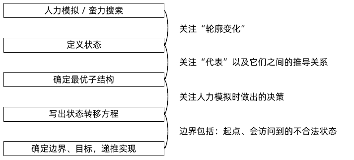


模板：

```python
        """
            方法一：动态规划
            画出状态空间，列出所有的方案。给每一组方案，选一个代表，把代表都选出来（动态规划的本质就是，确定上下两个代表之间的递推关系，如何从上一个推到下一个）。
            Step 1: 状态空间是啥？
            i： the last index
            f[i] 代表前i个数构成的，以nums[i]为结尾的，最长递增子序列的长度(or LIS-- longest increasing sequence)

            Step 2: 递推公式: ==> 你得把那2维图给画出来，再过一遍实例才能搞懂
                f[i] 表示前i个数构成的以a[i] 为结尾的最长上升子序列的长度
                需要枚举的决策空间：之前的 i-1种中，选择长度最大的, 即为 f[i] = Max{f[j]+1}, where j<i, and nums[j] < nums[i]  ==》 正因为i之前的每一个答案都要遍历一遍才能找到最大值，因此这个决定了时间复杂度会是 O(n^2)，空间复杂度是O(n)

            
            Step 3: 如何初始化?
                因为题目说了， 1<= nums.length <= 2500, 所以不用考虑 n==0的情况。因此当nums只有一个element时，那肯定是要的，就default 为1就好了。

            Step 4: 遍历顺序？ 
                     从前往后。只要满足递增关系，就要查看一下，是否比当前的答案更大，然后更新下答案。
            Step 5: 举几个例子来过一遍 ==> 看ppt 递归（1）
            e.g., [0, 3, 1, 6, 2, 7]
            0 --> 1         # 这就是初始的，当只有一个element时，那肯定是要的，就记为1好了
            3 --> [0, 3]    2       # 当nums[i] = 3 是，前面有一个 0 < 3, 满足要求，+1， 结果为2 （这里列出数组是告诉你这2代表什么，但我们真正记录的只有int)
            1 --> [0, 1]    2       # same as above
            6 -->  Max{[0], [0, 3] or ,[0, 1]} ==> [0, 3, 6] or [0, 1, 6]  3    # 当nums[i] = 6结尾时，我们有3个满足要求的答案, 但我们取最长的，然后+1
            2 --> [0, 2], [0, 1, 2]     3
            7 --> [0, 3, 6, 7](or [0, 1, 6, 7]) or [0, 1, 2, 7]     4   # 最长的LIS(Longest Increasing Sequences) is 4
        """
```

## 动态规划打印方案：

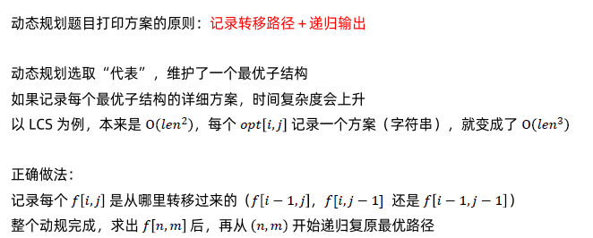


# 实战例题


## [零钱兑换](https://leetcode-cn.com/problems/coin-change/)（Medium）

- [零钱兑换](https://leetcode-cn.com/problems/coin-change/)（Medium）半年内出题频次：

| Facebook | 字节跳动 | 微软 | Amazon |
| :------: | :------: | :--: | :----: |
|    4     |    11    |  14  |   12   |

| 高盛集团 | 百度 | Google | 腾讯 |
| :------: | :--: | :----: | :--: |
|    4     |  2   |   6    |  8   |

| Bloomberg | Apple |
| :-------: | :---: |
|     6     |   4   |

Question:

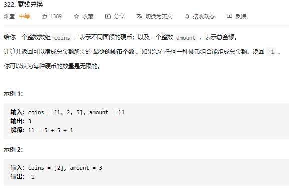

Idea:

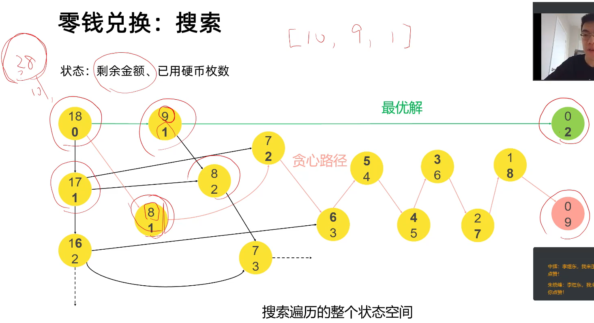

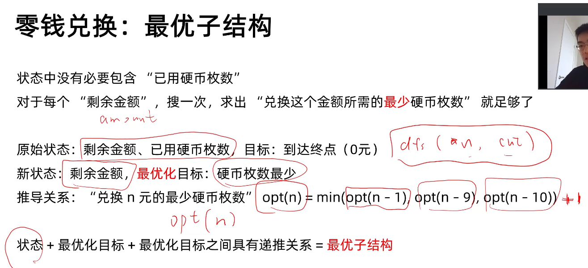

Python Code:

```python
class Solution(object):
    def coinChange(self, coins, amount):
        """
        :type coins: List[int]
        :type amount: int
        :rtype: int
        """

        """
        方法一：动态规划 -- Bottom-up的思考方式，用for loop来实现，没有递归。从最底层开始计算，然后利用之前算过的结果来计算下一层。
        思路：用过用递归，或者搜索的话，我们就要遍历整个搜索空间，所有的点，或者状态，才能得到一个解。而这过程我们注意到，一个金额被算了很多次，想要避免这个事情，我们就要计划搜索（或者记忆搜索），使得每个点只算一次。算什么呢？==》 算的是最少拼成一个金额所需的最优解。比如从一个点另一个点，有很多方式，但在一轮搜索中，我们只关心，只记录最优的路径 ==> 因此，这题的思路就是，对于每个amount， ”剩余金额“， 只搜索一次，就是求出”兑换这个金额所需的最少硬币枚数“，就足够了。
            - 目标：到达一个金额，所需的最少硬币个数
            - 状态变量：amount (原始状态：剩余金额; 最终停止状态：amount=0)
            - 另外，这里面有三个要关注的变量，coins，amount, and minimum_count。coins 是给定的，不会变的，所以不用管。minimum_counts 是我们的目标。因此这题的唯一动态变量，就是amount了。
        Note: 还不懂就看着ppt，再看一次
        Note2: 先写程序的主干，再写细节。
        """
        opt = [float("inf")] * (amount+1)   # 因为要找最小值，所以这里得初始一个特别大的值
        opt[0] = 0  # 当amount=0, 只需要0枚
        # 把每一个状态都for 一遍
        for i in range(amount+1):
            # 然后把，当前状态可以选择的决策都for一遍（就像回溯问题，dfs/bfs一样）, 也就是题目规定的所有面值，或者找钱的方法都for一遍. e.g., coins = [10, 9, 1], and amount = 18, than we want opt(18) = min（opt(18-1), opt(18-9), opt(18-10)) ==> 找最优解，并记录下来
            for j in range(len(coins)):
                if i - coins[j] >= 0:   # 比如当前amount是10， coins[j]=9, 那这种情况我们需要避免
                    opt[i] = min(opt[i], opt[i-coins[j]] + 1)       # 找最优解，并记录下来
        print(f"opt is {opt}")
        # 找出，且返回题目所要求的amount
        if opt[amount] == float("inf"):
            return -1
        else:
            return opt[amount]

    """
        总结：动态规划的思路，就是用一个数组来存储最优解(为了避免重复运算），然后用这些解决过的问题来找答案。
            比如 opt(11) = min(opt(11-1), opt(11-2), opt(11-5))     # ==》 有三条路可以走，但我们要找最少的。这有两种实现方法：1）递归实现，把opt当作function，然后用子函数来实现。2）把opt当作数组, that is min(opt[11-1], opt[11-2],  opt[11-5]). 所以在计算opt[11], 我们要先计算它前面的路径 -- 又有点像cse5525 里的 forward-and-backward。 你先forward一遍，把所有点的最优解算出来，然后再backward需按照你要的答案. 
            接下来那实例一为例子
        As final result, we have opt = [0, 1, 1, 2, 2, 1, 2, 2, 3, 3, 2, 3]

        min(0) ==> 0    # 表示没有答案, 一开始时要注意初始化这个为0
        min(1) ==> min(opt[1], opt[1-1]+1) = 1  # 因为opt[1]初始为 INF, 所以答案是opt[0]+1 = 1
        min(2）==> min(opt[2], opt[2-1]+1, opt[2-2]+1)=min(INF, 2, 1)=1
        min(3) ==> min(opt[3], opt[3-1]+1, opt[3-2]+1)=min(INF, 2, 2) = 2
        ....

        min(10) ==> min(opt[10], opt[10-1]+1, opt[10-2]+1, opt[10-5]+1) = min(INF, 4，4, 2)=2
        min(11)  ==> min(opt[11], opt[11-1]+1, opt[11-2],  opt[11-5]) = min(INF, 3, 4, 3) = 3 # 这有两个路径(5+6, or 10+1)，但结果是一样的
    """

class Solution2(object):
    def coinChange(self, coins, amount):
        """
            记忆化搜索的实现方式: 递归来实现，也就是Up-Down， 自顶向下的思考方式。只考虑顶层如何实现（但要记得consider edge case), 剩下的都用递归的方式来完成。 
        """
        self.coins = coins
        self.opt = [-1] * (amount+1)
        ans = self.calc(amount)
        return ans if ans < 1e9 else -1
    def calc(self, amount):
        if amount == 0:
            return 0
        if amount < 0:
            return 1e9
        if self.opt[amount] != -1:
            return self.opt[amount]
        self.opt[amount] = 1e9
        for coin in self.coins:
            self.opt[amount] = min(self.opt[amount], self.calc(amount- coin)+1)
        return self.opt[amount]

# Note: 以上两种实现方式的思想是一样的，但推荐第一种。因为用递归的话，是借用了function stack, each time you make a function call, you need some extra space and time to push and pop stack, that has some extra cost. 所以不管是时间上，还是空间上，第一种都要更高效一些。
```


## [不同路径 II ](https://leetcode-cn.com/problems/unique-paths-ii/)（Medium）

- [不同路径 II ](https://leetcode-cn.com/problems/unique-paths-ii/)（Medium）半年内出题频次：

| Facebook | 字节跳动 | 微软 | Amazon |
| :------: | :------: | :--: | :----: |
|    4     |    13    |  4   |   7    |

| 华为 | Bloomberg | Google |
| :--: | :-------: | :----: |
|  2   |     2     |   4    |

Question:


Idea:


Python code:

```python
class Solution:
    def uniquePathsWithObstacles(self, grid: List[List[int]]) -> int:
        """
            Step 1: 确定dp[i]的状态是什么，哪些是变量？ ==》很明显，棋牌上的障碍物是不变的，因此，这题的状态就是机器人的位置 [i, j]了

            Step 2: 确定递推公式
            注意，这题每次只能向下或者向右移动一步。因此当机器人在 pos[i][j] 时，它只能往两个方向走, pos[i-1][j] and pos[i][j-1]。而且，每一个位置到终点的路径（或，可走的方式）应该是不变的，所以这题可以用动态规划的方法，通过记录子问题的最优解，来找到题目要求的最优解。这题的递推公式就是:
                1) Top-down: 从起点到[0， 0]
                    f[i, j] 表示从start 到 [i,j]的路径数量，如果[i,j] is empty, then 
                        path(start, [i,j]) = path([i+1, j], end) + path([i, j+1], end)
                    otherwise, f[i,j]=0

                2) Bottom up:
                    f[i, j] 表示从[i,j] 到 end的路径数量，如果[i,j] is empty, then 
                        path([i,j], end) = path([i-1, j], end) + path([i, j-1], end)
                    otherwise, f[i,j]=0
            
            Step 3:  
            Summary: 状态是 [i, j], 目标是从[0, 0] [n-1, m-1]的路径数量，决策就是向下走，或者向右走两种方式

        """
        n, m = len(grid), len(grid[0])
        dp = [[0]*m] * n
        print(dp)

        # 因为从起点到终点，你只能往下和右走，那你在计算能到达一个点的路径数量是(决策数量)时，也只有两个选择（左和上）==》 不懂的话，看ppt上p17的图

        # 搭建dp记忆化数组. 
        # 遍历所有的状态
        for i in range(n):
            for j in range(m):
                # 然后遍历所有的决策：向右或者向下走（但你要反着考虑，比如你是如何来到 [i][j]这点的. Consider pos C, D, E)
                # start -> B  -> D
                # |        |
                # A ->    C
                # |
                # E
                if grid[i][j] == 1: # 如果是障碍物，就没法走了，那点就记为0
                    dp[i][j] = 0
                elif i == 0 and j == 0:   # 起始点记为1
                    dp[i][j] = 1
                elif i==0: # 如果在第0行/row, 我们只能往左边看（左边一格, [i][j-1]有几种方法，那[0][j] 的就有几种，）==》 不懂画图
                    dp[i][j] = dp[i][j-1]
                elif j==0:  # 如果在第0列/col, 我们只能往上看（上面一格,[i-1][j], 有几种方法，那[i][0]的就有几种，）==》 不懂画图
                    dp[i][j] = dp[i-1][j]
                else:   # 一般情况：两个字问题，二者相加
                    dp[i][j] = dp[i][j-1] + dp[i-1][j]
        return dp[n-1][m-1]

# Good Reference, https://leetcode-cn.com/problems/unique-paths-ii/solution/dai-ma-sui-xiang-lu-63-bu-tong-lu-jing-i-dha9/
```


## [最长公共子序列](https://leetcode-cn.com/problems/longest-common-subsequence/)（Medium）

- [最长公共子序列](https://leetcode-cn.com/problems/longest-common-subsequence/)（Medium）半年内出题频次：

| Facebook | 字节跳动 | 美团 | Amazon |
| :------: | :------: | :--: | :----: |
|    2     |    14    |  4   |   5    |

| Google | 腾讯 | 百度 |
| :----: | :--: | :--: |
|   5    |  5   |  3   |


Question:

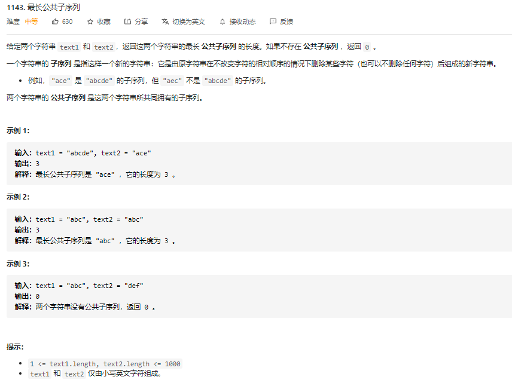

Idea:


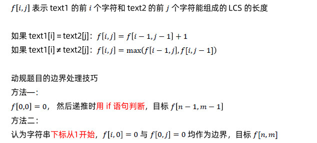


C++ code:

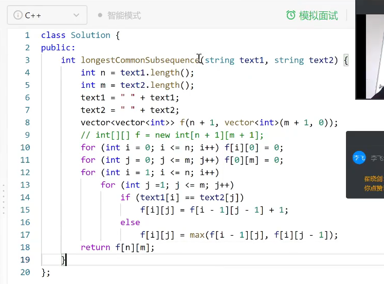

Java code:

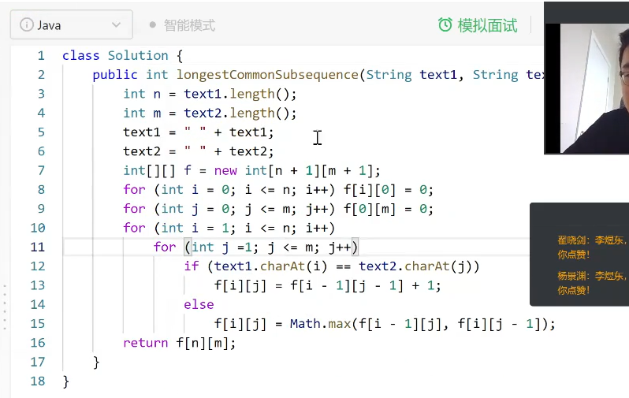

Python code:

```python
class Solution:
    def longestCommonSubsequence(self, text1: str, text2: str) -> int:
        """
            方法一：动态规划
            Step 1: 状态空间是啥？
            i,j 就是变化的量，i用于遍历text1的指针，j为用于遍历text2的指针，f[i,j]就表示text1 的前i个字符和text2的前j个字符能组成的LCS(longest Common Subsequence)的长度

            Step 2: 递推公式
            If text1[i]==text2[j]: f[i, j] = f[i-1, j-1] + 1 # 这说明i,j 两位之指向的都是相同的字符（e.g., in实例1， when f[i,j]=f[0,0] ==> text1[i] and text2[j] both points to 'a', then it match the requirement, we just need to increment the length)，那就肯定要，所以直接+1更新长度就完了。
            If text1[i] != text2[j]: f[i, j] = max(f[i-1, j], f[i, j-1])    # i，j两指针指向的是不同的字符, 那就枚举不同的策略，选最大的（因为题目要求找最长公共子序列）
            Step 3: 如何初始化? ==》 一开始啥都没有，所以default 为0
            Step 4: 遍历顺序？ 从前往后遍历，还是从后往前？         
            ==> 其实都可以. they just different way of thinking, Aka bottom-up or top-down ==> Normally, we always choose bottom up, because top-down requires some recursion, and computation time is longer. And bottom-up is more natual way for doing dynamic programming.
            Step 5: 举几个例子来过一遍 ==> 看ppt 递归（1）
        """
        n, m = len(text1), len(text2)
        # 因为在遍历过程中需要有 f[i-1, j-1]， 这要考虑到边界问题，所以补一个空格在每一个text前面
        text1, text2 = " " + text1, " " + text2
        print(f"text1:|{text1}|, text2:|{text2}|")
        # DP数组初始化， 一开始啥都没有，所以default 为0
        # f = [[0] * (m+1)] * (n+1)   #  ==> Dont use this, it's a trap. It will mess up your 2D array. 
        """
        >>> a = [[0]*3]*3
        >>> a
        [[0, 0, 0], [0, 0, 0], [0, 0, 0]]
        >>> a[0][0]=1
        >>> a
        [[1, 0, 0], [1, 0, 0], [1, 0, 0]]
        """
        f = [[0]*(m+1) for i in range(n+1)] 
        # print(f"# of row: {len(f)}, # of col: {len(f[0])}")

        # 遍历: 注意，要从index 1开始，因为第一个字符为空，是为了处理边界问题才加进去的
        for i in range(1, n+1):
            for j in range(1, m+1):
                if text1[i] == text2[j]:
                    f[i][j] = f[i-1][j-1]+1
                else:
                    f[i][j] = max(f[i-1][j], f[i][j-1]) # 两个字符不一样，所以还不能决定，所以不用+1
        return f[n][m]

```


## [最长递增子序列](https://leetcode-cn.com/problems/longest-increasing-subsequence/)（Medium）

- [最长递增子序列](https://leetcode-cn.com/problems/longest-increasing-subsequence/)（Medium）半年内出题频次：

| 华为 | 字节跳动 | 微软 | Amazon |
| :--: | :------: | :--: | :----: |
|  4   |    20    |  7   |   6    |

| Twitter | 百度 | Google | 腾讯 |
| :-----: | :--: | :----: | :--: |
|    3    |  4   |   7    |  4   |

| Bloomberg | Apple |
| :-------: | :---: |
|     3     |   4   |

Question:


Idea:

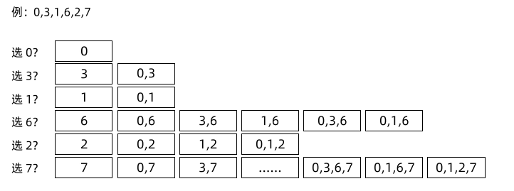

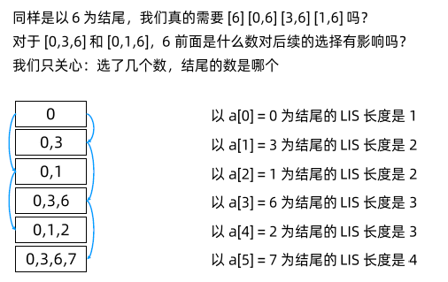

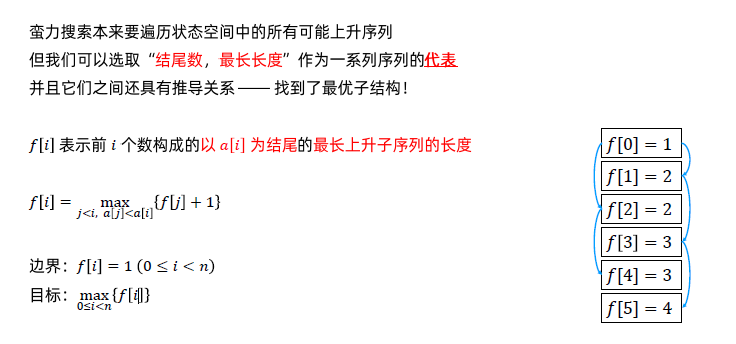

Python code:

```python
class Solution:
    def lengthOfLIS(self, nums: List[int]) -> int:
        """
            方法一：动态规划
            画出状态空间，列出所有的方案。给每一组方案，选一个代表，把代表都选出来（动态规划的本质就是，确定上下两个代表之间的递推关系，如何从上一个推到下一个）。
            Step 1: 状态空间是啥？
            i： the last index
            f[i] 代表前i个数构成的，以nums[i]为结尾的，最长递增子序列的长度(or LIS-- longest increasing sequence)

            Step 2: 递推公式: ==> 你得把那2维图给画出来，再过一遍实例才能搞懂
                f[i] 表示前i个数构成的以a[i] 为结尾的最长上升子序列的长度
                需要枚举的决策空间：之前的 i-1种中，选择长度最大的, 即为 f[i] = Max{f[j]+1}, where j<i, and nums[j] < nums[i]  ==》 正因为i之前的每一个答案都要遍历一遍才能找到最大值，因此这个决定了时间复杂度会是 O(n^2)，空间复杂度是O(n)

            
            Step 3: 如何初始化?
                因为题目说了， 1<= nums.length <= 2500, 所以不用考虑 n==0的情况。因此当nums只有一个element时，那肯定是要的，就default 为1就好了。

            Step 4: 遍历顺序？ 
                     从前往后。只要满足递增关系，就要查看一下，是否比当前的答案更大，然后更新下答案。
            Step 5: 举几个例子来过一遍 ==> 看ppt 递归（1）
            e.g., [0, 3, 1, 6, 2, 7]
            0 --> 1         # 这就是初始的，当只有一个element时，那肯定是要的，就记为1好了
            3 --> [0, 3]    2       # 当nums[i] = 3 是，前面有一个 0 < 3, 满足要求，+1， 结果为2 （这里列出数组是告诉你这2代表什么，但我们真正记录的只有int)
            1 --> [0, 1]    2       # same as above
            6 -->  Max{[0], [0, 3] or ,[0, 1]} ==> [0, 3, 6] or [0, 1, 6]  3    # 当nums[i] = 6结尾时，我们有3个满足要求的答案, 但我们取最长的，然后+1
            2 --> [0, 2], [0, 1, 2]     3
            7 --> [0, 3, 6, 7](or [0, 1, 6, 7]) or [0, 1, 2, 7]     4   # 最长的LIS(Longest Increasing Sequences) is 4
        """

        f = [1 for i in range(len(nums))]   # 为什么初始值都设为1？ ==》 因为每一个element都有可能作为起始点，所以当他被选中为起点时，LIS长度就是为1
        f[0] = 1
        for i in range(len(nums)):  # 遍历所有的状态空间 -- 
            for j in range(0, i):   # 遍历所有的决策 -- i 之前所有的答案
                if nums[j] < nums[i]:   # 只要满足递增关系，就要查看一下，是否比当前的答案更大, 然后更新下答案。
                    f[i] = max(f[i], f[j]+1)
        print(f"After DP process: {f}")

        ans = 0
        for i in range(len(f)):
            ans = max(ans, f[i])
        return ans
        
```


## [最大子序和](https://leetcode-cn.com/problems/maximum-subarray/)（Easy）

- [最大子序和](https://leetcode-cn.com/problems/maximum-subarray/)（Easy）半年内出题频次：

| Facebook | 字节跳动 | 微软 | Amazon |
| :------: | :------: | :--: | :----: |
|    7     |    20    |  16  |   19   |

| LinkedIn | Bloomberg | Google | 腾讯 |
| :------: | :-------: | :----: | :--: |
|    13    |     4     |   6    |  2   |

| eBay | Apple |
| :--: | :---: |
|  4   |  12   |

Question:

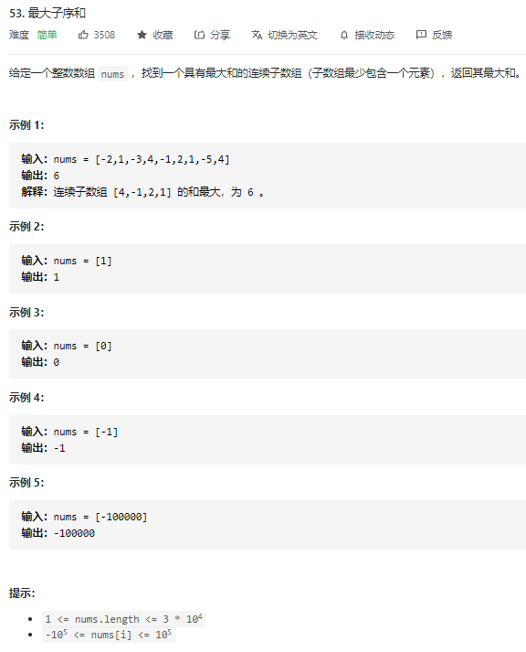

Idea:

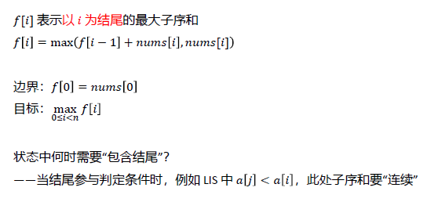

Python code:

```python
class Solution:
    def maxSubArray(self, nums: List[int]) -> int:
        """
        方法3：动态规划
            Step1: 状态空间：
            f[i] 表示以i为结尾的最大子序和
            Step 2: 递推公式：
                f[i] = max(f[i-1] + nums[i], nums[i])
            Step 3:  如何初始化，or 边界
                边界：f[0] = nums[0] 
                因为只要有第一个数存在，那开始这个书的最大子序和就是它本身
                目标：Find max{i=0}{n} f[i]
            Step 4: 遍历顺序
                先遍历空间，再遍历决策（这的决策就两种：1） f[i-1]的子序和为正，那肯定要呀，继续叠加 2) 前面子序和为负数 ==》 算了，我还是从我自己开始算吧）
            Step 5: 举例子
            nums = [-2, 1, -3, 4, -1, 2, 1, -5, 4]

            f[0] = -2
            f[1] = 1  ==> 前面为负数, 所以自己重开
            f[2] = max(1+(-3), -3) = -2
            f[3] = max(-3+4, 4) = 4     # 前面为负的，肯定不要
            f[4] = max(4+(-1), -1) = 3  # 前面为正的，肯定要
            f[5] = max(3+2, 2) = 5      # 前面为正的，肯定要
            f[6] = max(5+1, 1) = 6      # 前面为正的，肯定要
            ...
            f =    [-2, 1, -2, 4, 3,  5, 6,  1, 5]
        """             

        f = [0 for i in range(len(nums))]
        f[0] = nums[0]
        for i in range(1, len(nums)):
            f[i] = max(f[i-1]+nums[i], nums[i])
        
        print(f)
        return max(f)
```


## [乘积最大子数组](https://leetcode-cn.com/problems/maximum-product-subarray/)（Medium）

- [乘积最大子数组](https://leetcode-cn.com/problems/maximum-product-subarray/)（Medium）半年内出题频次：

| Facebook | 字节跳动 | 微软 | Amazon |
| :------: | :------: | :--: | :----: |
|    5     |    10    |  2   |   8    |

| 美团 | Shopee | Google | LinkedIn |
| :--: | :----: | :----: | :------: |
|  2   |   2    |   6    |    12    |

| Apple |
| :---: |
|   3   |

Question:

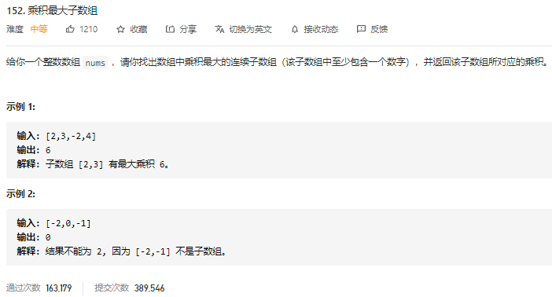

Idea:

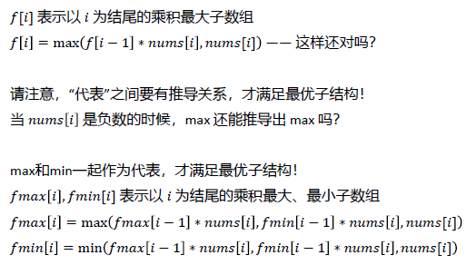

Python code:

```python
class Solution:
    def maxProduct(self, nums: List[int]) -> int:
        """
        方法一：动态规划
        思考：相比于53题的最大子序和，我们能直接把递推公式改成 "f[i] = max(f[i-1] * nums[i],  nums[i])" 吗？ ==》 不能，因为这个公式不能给出最优结构，就是，这个公式不能代表前后两个状态的最优推导关系。 Considering the case when nums[i] is negative value, do you thing the f[i-1]*nums[i] still will give us the largest product of first i element in nums? ==> No，因为考虑到有负数的情况，所以乘法的话是，乘以一个正数，就是越大越好，乘以一个负数，就是希望越小越好。所以这里我们可以多添加一个min的信息
        Step 1: 定义状态空间
            fmax[i]: 表示以i为结尾的乘积最大数组, 即为最大子序积
            fmin[i]: 表示以i为结尾的乘积最小数组, 即为最小子序积

        Step 2: 递推公式
            fmax[i] = max(fmax[i-1] * nums[i], fmin[i-1]*nums[i], nums)
            fmax[i] = min(fmax[i-1] * nums[i], fmin[i-1]*nums[i], nums)

        Step 3: 如何初始化
            边界：fmax[0], fmin[0] = nums[0], nums[0]
            因为只要有第一个数存在，那这个数本身就是答案
            目标：Find max(max(fmax), max(fmin))

        Step 4： 遍历顺序
            从前往后，先遍历状态空间，在遍历决策方案。
            
        Step 5: 举个例子
            nums = [2,3,-2,4]
            fmax[0] =fmin[0] = 2
            fmax[1] = max(3*2, 3*2, 2)=6, fmin[1] = min(3*2, 3*2, 2)=2
            fmax[2] = max(-2*6, -2*3, -2) = -2, fmin[2] = min(-2*6, -2*3, -2)=-12
            fmax[3] = max(4*-2, 4*-12, 4) = 4, fmin[2] = min(4*-2, 4*-12, 4) = -48

        """
        fmax = [0 for i in range(len(nums))]
        fmin = [0 for i in range(len(nums))]
        fmax[0], fmin[0] = nums[0], nums[0]

        for i in range(1, len(nums)):
            fmax[i] = max(fmax[i-1]*nums[i], fmin[i-1]*nums[i], nums[i])
            fmin[i] = min(fmax[i-1]*nums[i], fmin[i-1]*nums[i], nums[i])

        print(f"fmax: {fmax}, fmin: {fmin}")
        print(f"max(fmax): {max(fmax)}, max(fmin): {max(fmin)}")
        return max(max(fmax), max(fmin))
```


------

class12: 动态规划（二）

# 买卖股票系列问题

## [买卖股票的最佳时机](https://leetcode-cn.com/problems/best-time-to-buy-and-sell-stock/)（Easy）

- [买卖股票的最佳时机](https://leetcode-cn.com/problems/best-time-to-buy-and-sell-stock/)（Easy）半年内出题频次：

| Facebook | 字节跳动 | 微软 | Amazon |
| :------: | :------: | :--: | :----: |
|    14    |    24    |  17  |   36   |

| Bloomberg | SAP（思爱普） | Google | 腾讯 |
| :-------: | :-----------: | :----: | :--: |
|     6     |       3       |   12   |  3   |

| eBay | Apple |
| :--: | :---: |
|  5   |  11   |

Question:

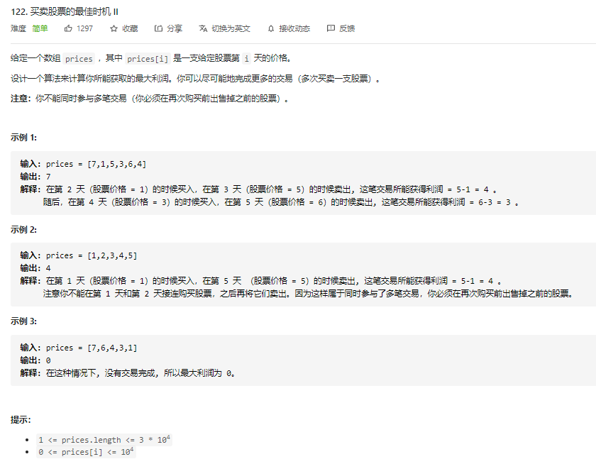

Idea:


Python code:

```python
class Solution1:
    def maxProfit(self, prices: List[int]) -> int:
        """
            方法一：暴力，直接把数组遍历一遍，维护一个当前看到的最小值。然后比较当前prices[i]和最小值的差，取最大的作为最后的答案，然后储存下来
        """
        minPrices = prices[0]
        ans = 0
        for i in range(len(prices)):
            minPrices = min(minPrices, prices[i])
            ans = max(ans, prices[i] - minPrices)
        
        return ans

class Solution:
    def maxProfit(self, prices: List[int]) -> int:
        """
            方法二：动态规划：

            状态空间：f[i] 表示prices[i]之前的可获得的最大利润差
            递推公式 f[i] = max(f[i-1], prices[i]-minPrices)
        """
        f = [0 for i in range(len(prices))]
        f[0] = 0
        minPrices = prices[0]
        for i in range(1, len(prices)):
            f[i] = max(f[i-1], prices[i]-minPrices)
            minPrices = min(minPrices, prices[i])
        print(f)
        return f[-1]
```


## [买卖股票的最佳时机 II ](https://leetcode-cn.com/problems/best-time-to-buy-and-sell-stock-ii/)（Easy）

- [买卖股票的最佳时机 II ](https://leetcode-cn.com/problems/best-time-to-buy-and-sell-stock-ii/)（Easy）半年内出题频次：

| Apple | 字节跳动 | 微软 | Amazon |
| :---: | :------: | :--: | :----: |
|   4   |    9     |  2   |   16   |

Question:

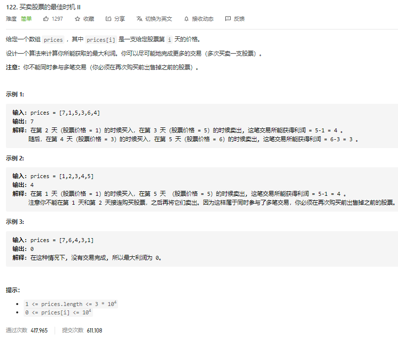

Idea:


Python code:

```python
class Solution1:
    def maxProfit(self, prices: List[int]) -> int:
        """
            方法一：贪心
            这题相比121的话就是，这题运行我们做多比交易来获取最大利润。但每次只能买卖一支股票。
            贪心的思想就是每次往后看一步，看是涨还是跌，然后来决定当前的股票应该是持有，还是卖掉。 ==》 这个是已知了未来股市的变化情况才能这么做的，现实当中肯定是用可能的。
        """
        ans = 0

        i = 0
        while i < len(prices)-1:    # why len(prices)-1? ==> Because We need look one more step in advance
            in_price, sell_price = 0, 0
            next_i = i+1
            print(f"prices[{i}]: {prices[i]}")
            if prices[next_i] > prices[i]:
                in_price = prices[i]
                sell_price = prices[next_i]
                print(f"in_price: {in_price}, sell_price: {sell_price}")
                # Keep looking at next step forward, if prices[next+1] > price[next], update next_i and sell_price
                while next_i+1 <= len(prices)-1 and prices[next_i+1] > prices[next_i]: # Check whether next_i is accessible and the condition is satisfied?
                    sell_price = prices[next_i+1]
                    next_i += 1

                ans += (sell_price - in_price)
            i = next_i

        return ans

# 下面是老师给的答案，看起来就比我的简练多了，> _ <!
class Solution:
    def maxProfit(self, prices: List[int]) -> int:
        ans = 0
        for i in range(1, len(prices)):
            ans += max(prices[i]-prices[i-1], 0)    # 言下之意就是，如果第二天股票市是涨的话，那我们就买入，获取这笔收益，否则就不做任何操作。
        return ans

"""
prices = [7,1,5,3,6,4]
ans = 0
prices[1]-prices[0]=1-7 =-6     # ==> ans=0, 跌了，不做任何操作
prices[2]-prices[1]=5-1 = 4     # ==》ans=4,  ok，吃掉这个利润   
prices[3]-prices[2]=3-5=-2      # ==> ans=4, 跌了，不做任何操作
prices[4]-prices[3]=6-3=3       # ==》ans=7,  ok，吃掉这个利润   
...
return ans = 7
"""
```


## [买卖股票的最佳时机 III ](https://leetcode-cn.com/problems/best-time-to-buy-and-sell-stock-iii/)（Easy）

- [买卖股票的最佳时机 III ](https://leetcode-cn.com/problems/best-time-to-buy-and-sell-stock-iii/)（Easy）半年内出题频次：

| Google | 字节跳动 | 富途证券 | Amazon |
| :----: | :------: | :------: | :----: |
|   2    |    4     |    3     |   7    |

Question:


Idea:

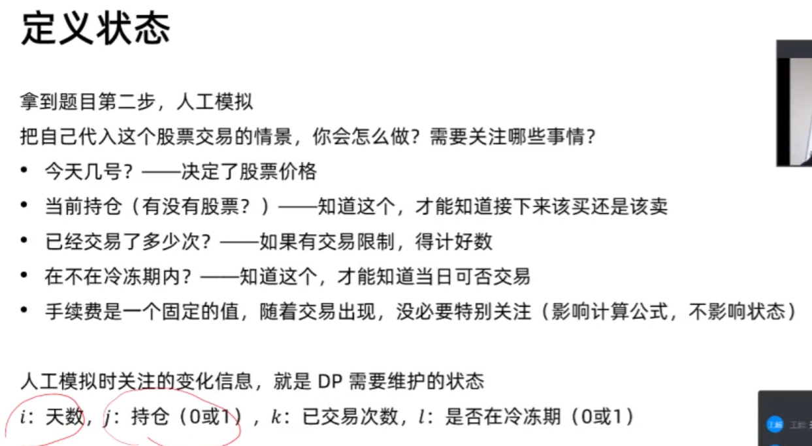


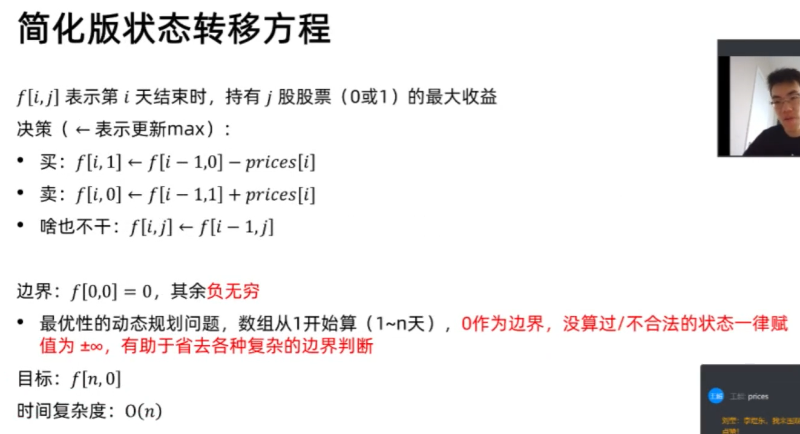


Python code:

```python

```


## [买卖股票的最佳时机 IV ](https://leetcode-cn.com/problems/best-time-to-buy-and-sell-stock-iv/)（Hard）

- [买卖股票的最佳时机 IV ](https://leetcode-cn.com/problems/best-time-to-buy-and-sell-stock-iv/)（Hard）半年内出题频次：

| 百度 | 字节跳动 | 富途证券 | Amazon |
| :--: | :------: | :------: | :----: |
|  2   |    3     |    2     |   8    |

Question:


Idea:


Python code:

```python

```


## [买卖股票的最佳时机含手续费](https://leetcode-cn.com/problems/best-time-to-buy-and-sell-stock-with-transaction-fee/)（Medium）

- [买卖股票的最佳时机含手续费](https://leetcode-cn.com/problems/best-time-to-buy-and-sell-stock-with-transaction-fee/)（Medium）半年内出题频次：

| Facebook | Bloomberg |
| :------: | :-------: |
|    2     |     2     |

Question:


Idea:


Python code:

```python

```


## [最佳买卖股票时机含冷冻期](https://leetcode-cn.com/problems/best-time-to-buy-and-sell-stock-with-cooldown/)（Medium）

- [最佳买卖股票时机含冷冻期](https://leetcode-cn.com/problems/best-time-to-buy-and-sell-stock-with-cooldown/)（Medium）半年内出题频次：

| 字节跳动 | Amazon |
| :------: | :----: |
|    5     |   2    |


# 线性 DP 问题

## [打家劫舍](https://leetcode-cn.com/problems/house-robber/)（Medium）

- [打家劫舍](https://leetcode-cn.com/problems/house-robber/)（Medium）半年内出题频次：

| Facebook | 字节跳动 | 微软 | Amazon |
| :------: | :------: | :--: | :----: |
|    3     |    32    |  13  |   10   |

| Cisco | Bloomberg | Google | 腾讯 |
| :---: | :-------: | :----: | :--: |
|   5   |     2     |   7    |  3   |

| eBay |
| :--: |
|  3   |

Question:


Idea:


Python code:

```python

```


## [打家劫舍 II- 环形 DP ](https://leetcode-cn.com/problems/house-robber-ii/)（Medium）

- [打家劫舍 II- 环形 DP ](https://leetcode-cn.com/problems/house-robber-ii/)（Medium）半年内出题频次：

| Facebook | 字节跳动 | 微软 | Amazon |
| :------: | :------: | :--: | :----: |
|    4     |    10    |  3   |   4    |

| eBay | 腾讯 |
| :--: | :--: |
|  5   |  5   |

Question:


Idea:


Python code:

```python

```


## [编辑距离（重点题）](https://leetcode-cn.com/problems/edit-distance/)（Hard）

- [编辑距离（重点题）](https://leetcode-cn.com/problems/edit-distance/)（Hard）半年内出题频次：

| 阿里巴巴 | 字节跳动 | 微软 | Amazon |
| :------: | :------: | :--: | :----: |
|    2     |    19    |  12  |   11   |

| 网易 | 携程集团 | Google | 腾讯 |
| :--: | :------: | :----: | :--: |
|  2   |    2     |   4    |  3   |

| 小米 | Apple |
| :--: | :---: |
|  2   |   3   |

Question:


Idea:


Python code:

```python

```


# **背包问题**

## [分割等和子集](https://leetcode-cn.com/problems/partition-equal-subset-sum/)（Medium）

- [分割等和子集](https://leetcode-cn.com/problems/partition-equal-subset-sum/)（Medium）半年内出题频次：

| Facebook | 字节跳动 | 微软 | Apple |
| :------: | :------: | :--: | :---: |
|    5     |    4     |  2   |   2   |

| Bloomber | Google |
| :------: | :----: |
|    2     |   2    |


Question:


Idea:


Python code:

```python

```


## [零钱兑换 II ](https://leetcode-cn.com/problems/coin-change-2/)（Medium）

- [零钱兑换 II ](https://leetcode-cn.com/problems/coin-change-2/)（Medium）半年内出题频次：

| Facebook | 字节跳动 | 微软 | Amazon |
| :------: | :------: | :--: | :----: |
|    3     |    6     |  5   |   2    |

| 华为 | Bloomberg | 蔚来 | Apple |
| :--: | :-------: | :--: | :---: |
|  3   |     2     |  2   |   4   |

Question:


Idea:


Python code:

```python

```


# 第 13 课: 动态规划的优化

- [满足不等式的最大值](https://leetcode-cn.com/problems/max-value-of-equation/)（Hard）半年内出题频次：

| Google |
| :----: |
|   15   |

Question:


Idea:


Python code:

```python

```


- [环形子数组的最大和](https://leetcode-cn.com/problems/maximum-sum-circular-subarray/)（Medium）半年内出题频次：

| 字节跳动 |
| :------: |
|    2     |

Question:


Idea:


Python code:

```python

```


## 区间动态规划

- [戳气球](https://leetcode-cn.com/problems/burst-balloons/)（Hard）半年内出题频次：

| Google | 字节跳动 | Bloomberg | Amazon |
| :----: | :------: | :-------: | :----: |
|   2    |    4     |     2     |   3    |


Question:


Idea:


Python code:

```python

```


- [合并石头的最低成本](https://leetcode-cn.com/problems/minimum-cost-to-merge-stones/)（Hard）半年内出题频次：

| Amazon |
| :----: |
|   6    |

Question:


Idea:


Python code:

```python

```


