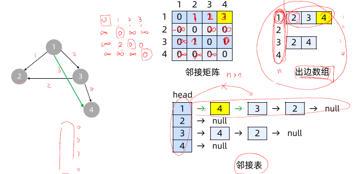
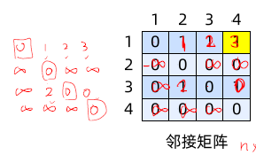
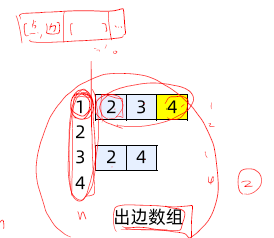
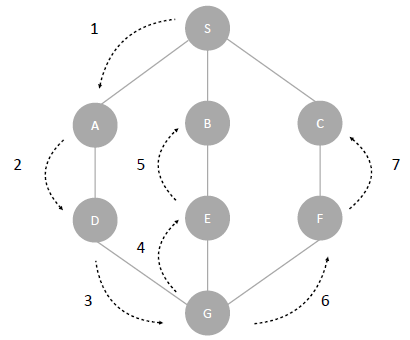
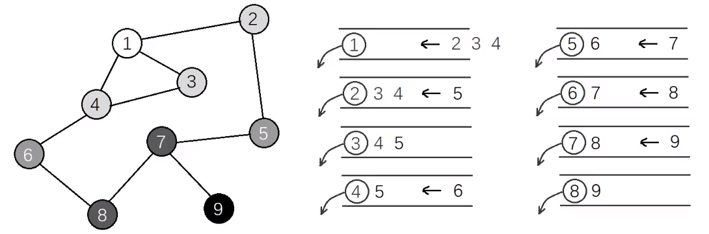
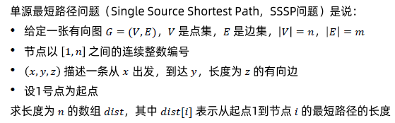
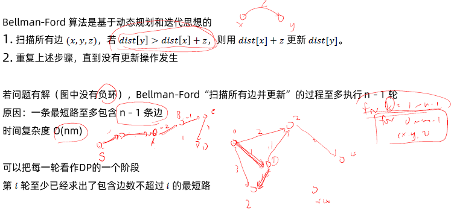
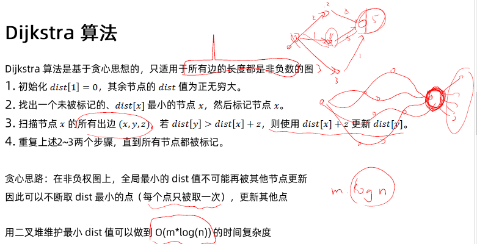
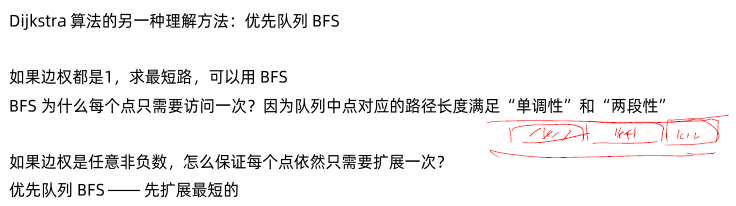
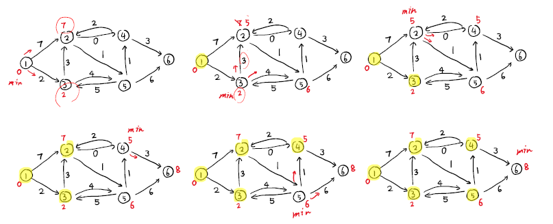

[TOC]


# 第 15 课：图的基本概念与算法

## **图存储的三种方式**



1. 邻接矩阵`[i, j]`, 空间复杂度`o(n^2)`. The value at each grid can represent as the length of an edge between tow adjacent node; 0 means the node is connected to itself, and we use infinite to indicate there no way to connect two nodes. In some case, if there is no meaning for edge, we can just use 0 and 1, where 1 indicate an connection between two node, and 0 mean no connection. 
   - 
2. 出边数组`vector<vector>`，空间复杂度`o(点数+边数)`
   - 如果要存边的长度该怎么办？==》把array里的每一个元素改成, tuple or list, e..g, vector<node: int, edge_length: int>
   - 
3. 邻接表(知道就行了,一般不会用)
   - 如果要存边的长度该怎么办？==》和出边数组是一个道理，每个node里可以存anything you want.

### 邻接表 Vs 出变数组

邻接表和出变数组效率上是差不多的，但出边数组更容易实现。下面解释下具体的差别。

- insert：如果是在第一个位置加，那两个种方式都很快，都是O(1); 但如果在最后insert，邻接表就需要遍历到linked list的尾部，and 出边数组需要扩容，所以都是O(n)。But, for resizable array, we always need to double the memory size when we reach a limit, and copy all element to new array, so the dynamic array is more expensive in average.
- delete: same as insert, when the memory usage is less than 25%, we will half the memory size for list/array/vector.
- look_up: 出边数组是O(1)， and 邻接表是O(n)

总的来说出边数组就是用以个数组来记录每一个节点的children Node, and邻接表用的就是一个linked list. 但总的来说，出边数组操作速度会更快，所以一般首选出边数组。==》实现的话就是，C++‘s vector, Java’s ArrayList, and Python’s List[] ==> 他的缺点就是扩容时比较慢。


## 图的深度优先遍历



## 图的广度优先遍历




# 最短路径


## 单源最短路径问题




## Bellman-Ford Algorithm – 用的是DP全局最优的思想




### Dijkstra Algorithm – 用的是局部贪心的思想






## 实战例题:  最短路

### [网络延迟时间](https://leetcode-cn.com/problems/network-delay-time/)（Medium）

- [网络延迟时间](https://leetcode-cn.com/problems/network-delay-time/)（Medium）半年内出题频次：

| Google | 字节跳动 | Amazon |
| :----: | :------: | :----: |
|   3    |    2     |   4    |

Question:


Idea:


Python Code:

```python

```


### [阈值距离内邻居最少的城市](https://leetcode-cn.com/problems/find-the-city-with-the-smallest-number-of-neighbors-at-a-threshold-distance/)（Medium）

- [阈值距离内邻居最少的城市](https://leetcode-cn.com/problems/find-the-city-with-the-smallest-number-of-neighbors-at-a-threshold-distance/)（Medium）半年内出题频次：

| 阿里巴巴 |
| :------: |
|    8     |

Question:


Idea:


Python Code:

```python

```


### [ Dijkstra 求最短路 II ](https://www.acwing.com/problem/content/852/)（Easy）

- [ Dijkstra 求最短路 II ](https://www.acwing.com/problem/content/852/)（Easy）（ACWing）


# 最小生成树


## 第 15 课： 最小生成树

### [连接所有点的最小费用](https://leetcode-cn.com/problems/min-cost-to-connect-all-points/)（Medium）

- [连接所有点的最小费用](https://leetcode-cn.com/problems/min-cost-to-connect-all-points/)（Medium）半年内出题频次：

| Amazon |
| :----: |
|   3    |

Question:


Idea:


Python Code:

```python

```


