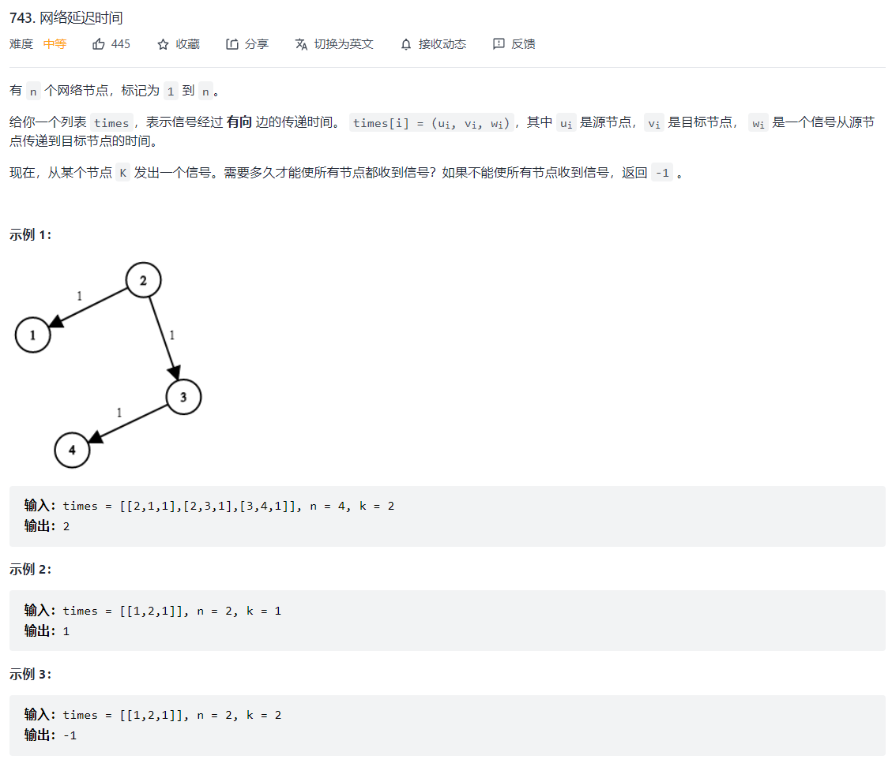
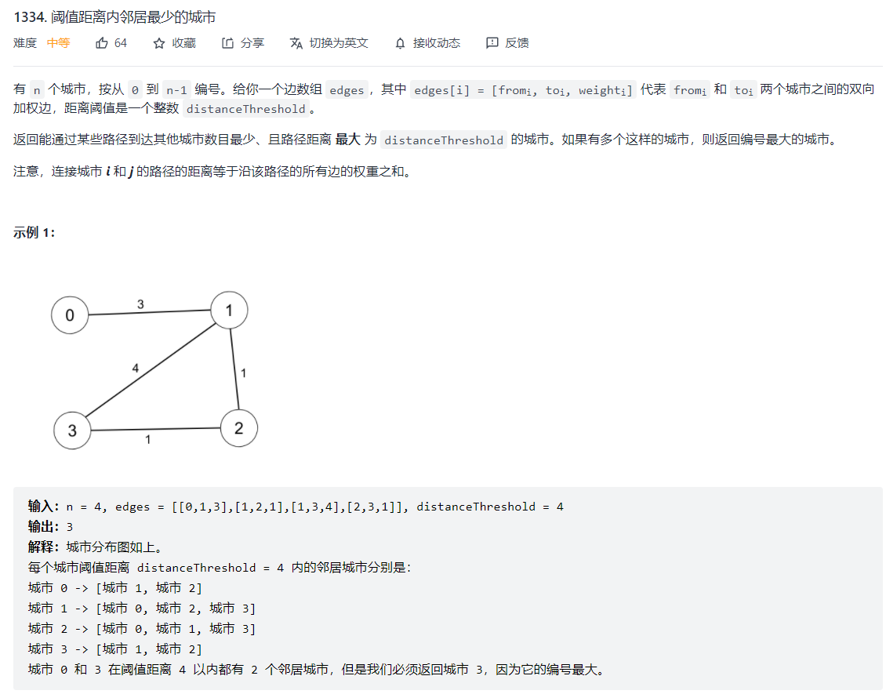
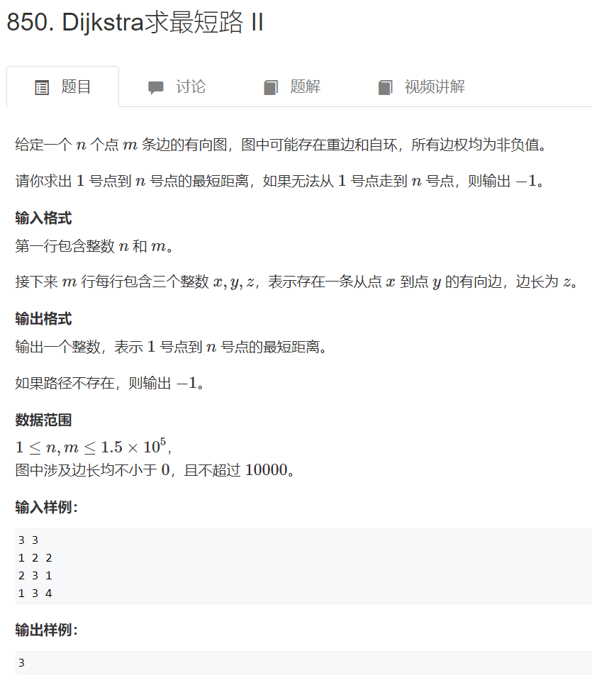

[TOC]


# 第 15 课：图的基本概念与算法

## **图存储的三种方式**


1. 邻接矩阵`[i, j]`, 空间复杂度`o(n^2)`. The value at each grid can represent as the length of an edge between tow adjacent node; 0 means the node is connected to itself, and we use infinite to indicate there no way to connect two nodes. In some case, if there is no meaning for edge, we can just use 0 and 1, where 1 indicate an connection between two node, and 0 mean no connection. 
   - 
2. 出边数组`vector<vector>`，空间复杂度`o(点数+边数)`
   - 如果要存边的长度该怎么办？==》把array里的每一个元素改成, tuple or list, e..g, vector<node: int, edge_length: int>
   - 
3. 邻接表(知道就行了,一般不会用)
   - 如果要存边的长度该怎么办？==》和出边数组是一个道理，每个node里可以存anything you want.

### 邻接表 Vs 出变数组

邻接表和出变数组效率上是差不多的，但出边数组更容易实现。下面解释下具体的差别。

- insert：如果是在第一个位置加，那两个种方式都很快，都是O(1); 但如果在最后insert，邻接表就需要遍历到linked list的尾部，and 出边数组需要扩容，所以都是O(n)。But, for resizable array, we always need to double the memory size when we reach a limit, and copy all element to new array, so the dynamic array is more expensive in average.
- delete: same as insert, when the memory usage is less than 25%, we will half the memory size for list/array/vector.
- look_up: 出边数组是O(1)， and 邻接表是O(n)

总的来说出边数组就是用以个数组来记录每一个节点的children Node, and邻接表用的就是一个linked list. 但总的来说，出边数组操作速度会更快，所以一般首选出边数组。==》实现的话就是，C++‘s vector, Java’s ArrayList, and Python’s List[] ==> 他的缺点就是扩容时比较慢。


## 图的深度优先遍历


## 图的广度优先遍历


# 最短路径


## 单源最短路径问题


## Bellman-Ford Algorithm – 用的是DP全局最优的思想


### Dijkstra Algorithm – 用的是局部贪心的思想


## 实战例题:  最短路

### [网络延迟时间](https://leetcode-cn.com/problems/network-delay-time/)（Medium）

- [网络延迟时间](https://leetcode-cn.com/problems/network-delay-time/)（Medium）半年内出题频次：

| Google | 字节跳动 | Amazon |
| :----: | :------: | :----: |
|   3    |    2     |   4    |

Question:



Idea:


Python Code:

```python
class Solution:
    def networkDelayTime(self, times: List[List[int]], n: int, k: int) -> int:
        """
            方法一：Bellman-ford
            这道题就是单源最短路径问题。题意是模拟发电站，从图里某个点开始发电，信号能传播到图里每个用户所需的最短时间。==》 也就是用bellman-fort, 找出从源点到每个点的最短路径，然后返回最大值(花时间最长的那个)
            实现：
                初始化：
                    - 创建一个长度为n+1的vector， 初始值都为infinite/2 （why /2? --> 为了考虑到两个是相加可能会越界的问题， 就是计算dis[x]+z < dist[y] 时)
                    - 设置起始点为0
                Bellman-ford algorithm:
                    - 外层, for n-1 轮，
                        - 里面每轮，for each edge
                            - 判断是否可以更新dist[y], source 到当前节点的最短长度
                            - 没有更新，直接退出 （减少计算量)
                根据题意，找出答案：
                    - 正常情况（无负环): 直接返回最大值
                    - 考虑带环, 或者走不通的情况 --》-1
                （Bonus)打印路劲：
                    - 用一个 n-1长的vector

            # 复杂度：O(N*M), where N is the number of vertices, and M is the number of edges
        """
        # 需要一个array来记录起点到其他的每个点的最短路径或者消耗（dist/weight/cost)
        # 注意：这题的index是从1开始的，不是0
        dist = [2**31 for i in range(n+1)]    
        # In here, why we should use 2^31 instead of float('inf')? ==> because we want to avoid stack overflow(for operation, dist[u] + w). Note:  The signed version goes from -2^31-1 to 2^31, which is –2,147,483,648 to 2,147,483,647 or about -2 billion to +2 billion
        dist[k] = 0

        # Bellman-ford algo: 把每个点过一遍 ==》再把每个点相连的边给过一遍 ==》 保留两点之间距离最短，或消耗最少的最为答案，存起来。
        for i in range(1, n):
            update = False
            for edge in times:
                u = edge[0]
                v = edge[1]
                w = edge[2]
                # Relaxation Step：
                if dist[u] + w < dist[v]:
                    dist[v] = dist[u] + w
                    update = True

            # 提前结束：剪枝原理 ==》从一个点出发，每条边都过了一遍，居然没有一条边需要更新的，那就可以提前结束了 （如果你不放心的话，删掉也没问题）
            if update == False:
                break
        
        # Find the ans: Check the time cost for each node, and save the max as final result
        ans = 0
        for i in range(1, n+1):
            ans = max(ans, dist[i])
        # For the case that there is a negative circle
        if ans == 2**31:
            ans = -1
        return ans
            
# Extra Question: 如何打印出答案的方案(or 路径)？就是从root到答案的路径的方案
# 带打印路径结果的bellman-ford algo
class Solution2:
    def networkDelayTime(self, times: List[List[int]], n: int, k: int) -> int:
        dist = [2**31 for i in range(n+1)]    # Why n+1? start from 1, not 0 (check the range of k and n)
        dist[k] = 0

        path = [-1 for i in range(n+1)] # 用于打印路径

        # Bellman-ford algo
        for i in range(n-1):
            flag = False
            for edge in times:
                u, v, w = edge
                # Relaxation Step
                if dist[u] + w < dist[v]:
                    dist[v] = dist[u] + w
                    path[v] = u     # 用于打印路径
                    flag = True
            if flag == False:
                break
        ans = 0
        ans_from = 0
        for i in range(1, n+1): 
            if dist[i] > ans:
                ans = dist[i]   # 遍历每个点时，找路径最长的那个（题目要求)
                ans_from = i    # 记录最长那个点的上一个点的来源index (用于打印路径)
        # 如果没有 negative circle， 那就可以 打印路径
        if ans == 2**31:
            ans = -1
        else:   # 打印路径
            flag = True
            print(f"Last Node({ans_from})", end="")
            while ans_from != k:
                print(f"<== {path[ans_from]}", end="")
                ans_from = path[ans_from]   # 应为path[i]
            print()
        return ans


class Solution3:
    def networkDelayTime(self, times: List[List[int]], n: int, k: int) -> int:  
        """
            方法二：Dijkstra’s (迪杰斯特拉)
            其实就是bfs的实现方法
            - Why 迪杰斯特拉 faster than bellman-fort? --> 回忆bellman-fort, 遍历每条边的顺序都是随意的，这就造成了很多redundant computation。 换个方式来思考，我们可不可以按照cost从小到大的顺序来更新？换句话说，可不可以先explore, 扩展结点cost比较小的呢？ 
                - 其实 迪杰斯特拉 就是基于 bellman-fort的一个贪心思想上的优化, 减少冗余，减少搜索成本。--》 比如，如果当前cost最小的并不是全局最优的，那之后会先考虑cost第二小的进行探索，如果第二小的也不是最优的，那就再考虑cost第三小的，看能不能更新。但如果没有更新，算法就会直接结束。
                - 这该如何实现呢？==》 
                    - 初始化dst[src] = 0, 其余节点dist[i] 为 infinite
                    - 我们可以给选过的点做标记，每次explore新的边时，就要找一个未标记的，dist[x]值最小的，然后标记结点[表示遍历过了]
            - Note: 但要注意，图里的cost不能有negative value.
            - 复杂度分析：如果使用堆优化的BFS, 那就是O( (N+M)log(N) ) --》 一般认为边数比点数多，就可以简写成 O(M*Log(N))
        """
        # 建图：
        V =[[] for i in range(n+1)]  # Save 出边数组, each V[i] return a list of vertices that connect to it
        E = [[] for i in range(n+1)]     # the len/cost/weight of edge, each E[i] return the length of a list of edges that connect to V[i]
        for edge in times:
            x, y, z = edge
            V[x].append(y)
            E[x].append(z)

        print(f"V: {V}, E: {E}")
        dist = [2**31 for i in range(n+1)]
        dist[k] = 0
        visited = [False for i in range(n+1)]

        q = BinaryHeap()    # store a pair<length: int, id: int>
        q.push((dist[k], k))
        # Dijsktra algo
        while q.size() != 0:
            length, x = q.pop() # x is the idx
            if visited[x]: # 每个点只需要扩展一次，如果explord过了，就跳过，没必要在扩展了
                continue
            visited[x] = True
            # print(f"length: {length}, x: {x}")
            # Explored V[x] -- 访问所有的出边，尝试更新（or relex)
            for i in range(len(V[x])):    # x, y indicate idx, and z is the cost, or length of edge
                y = V[x][i]   # V[x][i] ==> y, 可以看出V[x]存的是所有连接x的点，i是每个点遍历的idx
                z = E[x][i]   # E[x][i] ==> z, 可以看出E[x]存的是所有连接x的边，i是edge[x, y]的长度/cost/weight
                if dist[x] + z < dist[y]:
                    dist[y] = dist[x] + z
                    q.push((dist[y], y))
            
        # print(dist)
        ans = 0
        for i in range(1, n+1):
            ans = max(ans, dist[i])
        if ans == 2**31:
            ans = -1
        return ans

        
# Good Reference: 1) https://leetcode-cn.com/problems/design-twitter/solution/dui-you-xian-dui-lie-by-hw_wt-tb9g/， 2）https://leetcode-cn.com/problems/network-delay-time/solution/wang-luo-yan-chi-shi-jian-dan-yuan-zui-d-m1m3/
class BinaryHeap():
    def __init__(self):
        self.minHeap = []   # start 
    def __repr__(self):
        return self.minHeap.__repr__()
    def __str__(self):
        return self.minHeap.__str__()
    
    def leftChild(self, i):
        return 2*i+1

    def rightChild(self, i):
        return 2*i + 2
    
    def parent(self, i):
        return (i-1)//2

    def swap(self, id1, id2):
        self.minHeap[id1], self.minHeap[id2] = self.minHeap[id2], self.minHeap[id1]

    def size(self):
        return len(self.minHeap)
    
    def peak_top(self):
        return self.minHeap[0]

    # Just append it to the end, and perform a heapifyUp
    def push(self, node):
        self.minHeap.append(node)
        i = len(self.minHeap)-1
        # Heapify Up: 把新来的放到最后，然后不停的向上调整
        while i>0:
            fa = self.parent(i)
            if self.minHeap[i][0] < self.minHeap[fa][0]:    # 因为这heap里存的是一个pair, 这比较的是pair里的第一个元素
                self.swap(i, fa)
                i = fa
            else:
                break
    
    # Extract the first one and return as the answer, and replace the first spot with the last one, and perform heapify Down
    def pop(self):
        if len(self.minHeap)==0:
            return 
        ans = self.minHeap[0]
        self.minHeap[0] = self.minHeap[-1]
        self.minHeap.pop()
        # Heapify Donw
        j = 0
        flagDone = False
        while flagDone!= True:
            smallest = j
            L = self.leftChild(smallest)
            R = self.rightChild(smallest)
            if L < len(self.minHeap) and self.minHeap[L][0] < self.minHeap[smallest][0]:
                smallest = L
            if R < len(self.minHeap) and self.minHeap[R][0] < self.minHeap[smallest][0]:
                smallest = R
            if smallest != j:
                self.swap(j, smallest)
                j = smallest
            else:
                flagDone = True 
        return ans
```


### [阈值距离内邻居最少的城市](https://leetcode-cn.com/problems/find-the-city-with-the-smallest-number-of-neighbors-at-a-threshold-distance/)（Medium）

- [阈值距离内邻居最少的城市](https://leetcode-cn.com/problems/find-the-city-with-the-smallest-number-of-neighbors-at-a-threshold-distance/)（Medium）半年内出题频次：

| 阿里巴巴 |
| :------: |
|    8     |

Question:



Idea:


Python Code:

```python
class Solution:
    """
        Bellman-ford:
        bellman-ford只能解决单源最短路径问题，如果要用于解决多源的话，其思路就是把所有的源点都过一遍。
    """
    def findTheCity(self, n: int, edges: List[List[int]], distanceThreshold: int) -> int:
        def Bellman_Ford(src, threhold):
            # Initialization
            dist = [2**30 for i in range(n)]
            dist[src] = 0

            # Bellman-ford
            for node in range(n):
                hasUpdate = False
                for edge in edges:
                    x = edge[0]
                    y = edge[1]
                    cost = edge[2]
                    if dist[x] + cost > dist[y]:
                        dist[y] = dist[x] + cost
                        hasUpdate = True
                if not hasUpdate:
                    break

            # Return the number of city that are reachable within the range of threhold
            count = 0
            for i in range(n):  # index: 0~n
                if i != src and dist[i] <= threhold:
                    count+=1
            return count        

        import heapq
        # def Djikstra(src, threhold):
        #     # 建图--用出边数组：--》 因为
        #     V =[[] for i in range(n+1)]  # Save 出边数组, each V[i] return a list of vertices that connect to it
        #     E = [[] for i in range(n+1)]     # the len/cost/weight of edge, each E[i] return the length of a list of edges that connect to V[i]
        #     for edge in times:
        #         x, y, z = edge
        #         V[x].append(y)
        #         E[x].append(z)

        #     # 初始化
        #     print(f"V: {V}, E: {E}")
        #     dist = [2**31 for i in range(n+1)]
        #     dist[k] = 0
        #     visited = [False for i in range(n+1)]
            

        def Djikstra(src, threhold):
            # Initialization
            BIG = 2**30
            Map = [[BIG]*n for i in range(n)] # Build the graph, an n X n matrix
            adj = [[] for i in range(n)]
            dist = [BIG for i in range(n)]
            dist[src] = 0

            minHeap = [(dist[i], i) for i in range(n) if dist[i] < BIG]
            heapq.heapify(minHeap)

            for i in range(n):
                Map[i][i] = 0
            for a, b, w in edges:
                Map[a][b] = Map[b][a] = w
                adj[a].append(b)
                adj[b].append(a)
            
            # Dijkstra
            while minHeap:
                Min, u = heapq.heappop(minHeap)
                for v in adj[u]:
                    alt = dist[u] + Map[u][v]
                    if alt < dist[v]:
                        dist[v] = alt
                        heapq.heappush(minHeap, (dist[v], v))
            
            # Return the number of city that are reachable within the range of threhold
            count = 0
            for i in range(n):  # index: 0~n
                if i != src and dist[i] <= threhold:
                    count+=1
            return count         
        
        """
            Floyd: floyd 算法就是用来解决多源路径最短问题的。算法可以在O(n^3) 时间内求出途中每一对点之间的最短路径，本质上是动态规划算法
            - dp[k, i, j]表示从i到j的最短路径，经过编号不超过k的点为中继，==> 决策就是决定，中继点是否使用
            - dp[k, i, j] = min(dp[k-1, i, j], dp[k-1, i, k] + dp[k-1, k, j]) --> 可以省掉第一维，变成两维的dp数组 --》d[i,j] = min(d[i,j], d[i,k]+d[k,j])
            - k 表示中继点，然后用中继点将整个path划分成两半。确保左边从i 到 k-1 所经过的节点都是最短的，右边从k
            - 矩阵如何初始化？--》 
                - 使用矩阵来存图，如果图带权，dist[i][i]，对角线上都是0；
                - dist[x][y]=dist[y][x]=z, 输入的边就是输入的值/权重；
                - 剩余的都是正无穷，infinite or anything big enough
        """
        def Floyd(threhold):
            dist = [[1e9]*n for i in range(n)]
            for i in range(n):  # diagnal cell all set to 0 -- 一个点不能从自己连到自己
                dist[i][i] = 0
            
            for edge in edges:  # 注意这的graph是一个undirected graph
                x = edge[0]
                y = edge[1]
                z = edge[2]
                dist[x][y] = z
                dist[y][x] = z
            
            # Floyd: 其实就是一个3维DP数组。why k是第一维的? 因为他是中继点, 决定是阶段。(Dp 核心思想：阶段--》状态--》决策)。动规是按顺序的, 分阶段的一个遍历，必须得当dp[k-1, i, j]都算好了之后才能计算dp[k,i,j]
            
            for k in range(n):
                for i in range(n):
                    for j in range(n):
                        dist[i][j] = min(dist[i][j], dist[i][k]+dist[k][j])

            # 自己不算，且d[i][j]阈值在threshold以内
            # Return the number of city that are reachable within the range of threhold
            ansCount, ans = n, 0    # n
            for i in range(n):
                count = 0   # counting the number of city is reachable and within threhold, from city i as source
                for j in range(n):
                    if i!=j and dist[i][j] <= threhold:
                        count += 1
                # count代表的是从i出发，在阈值内能到达的城市的数量。
                # 但由于问题问的是 数目最少的 ==》 所以是 <, 但由于要返回的是城市的index(0作为第一个), 所以还要更新ans
                # 但为什么要用 <= 呢？ ==》 因为题目要求 “且如果有多个这样的城市，则返回编号最大的城市“， <= 可以更新掉编号小的城市
                if count <= ansCount:
                    ansCount = count
                    ans = i
                
            return ans   
        
        # 统计答案
        ansCount, ans = n, 0    # n
        algorithm_to_run = "Floyd"  # ["Djikstra", "Bellman_Ford", "Floyd"]
        if algorithm_to_run == "Floyd": 
            ans = Floyd(distanceThreshold)
        else:
            for i in range(n):
                count = Djikstra(i, distanceThreshold)
                if ansCount >= count:
                    ansCount = count
                    ans = i

        return ans

# Note: 对比几种算法可以发现，floyd才是解决的这种多源最短路径，或者多个点对多个点问题的最优方案
```


### [ Dijkstra 求最短路 II ](https://www.acwing.com/problem/content/852/)（Easy）

- [ Dijkstra 求最短路 II ](https://www.acwing.com/problem/content/852/)（Easy）（ACWing）

Question:



Idea:


Python Code:

```python
from heapq import *

if __name__ == "__main__":
    n, m = map(int,input().split())
    
    ver = [[] for i in range(n + 1)] # 0~n
    edge = [[] for i in range(n + 1)] # 0~n
    dist = [1e9] * (n + 1)
    v = [False] * (n + 1)
    
    # 出边数组建图
    for i in range(m):
        x, y, z = map(int,input().split())
        ver[x].append(y)  # 另一端点
        edge[x].append(z) # 边权

    heap = []
    heappush(heap, (0, 1)) # (距离, 点)
    dist[1] = 0

    # Dijkstra 算法
    while heap:
        distance, x = heappop(heap)
        if v[x]:
            continue
        v[x] = True

        for i in range(len(ver[x])):
            y, z = ver[x][i], edge[x][i]
            if dist[y] > dist[x] + z:
                dist[y] = dist[x] + z
                heappush(heap, (dist[y], y))

    print(dist[n] if dist[n] != 1e9 else -1)

```


# 最小生成树


## 第 15 课： 最小生成树

### [连接所有点的最小费用](https://leetcode-cn.com/problems/min-cost-to-connect-all-points/)（Medium）

- [连接所有点的最小费用](https://leetcode-cn.com/problems/min-cost-to-connect-all-points/)（Medium）半年内出题频次：

| Amazon |
| :----: |
|   3    |

Question:


Idea:


Python Code:

```python

```


