## 递归recursion

### 基础知识点

**特点：**

- 函数自身调用自身
- 通过函数体来进行循环
- 以相似的方法重复进行的过程

**Motivation: why we want to use recursion? and when to use it?**

- 当你不知道推导路径的时候，需要向下探索一遍来找到此路径时
  - 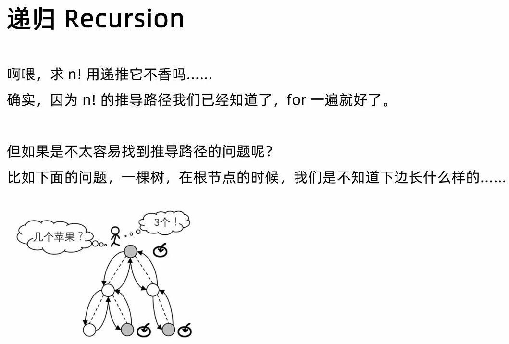
- 当原问题有多个相同的子问题构成
  - 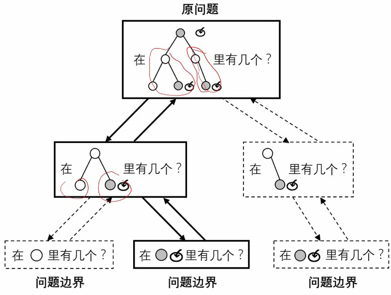
  - 

**递归的三个关键**

- 定义需要递归的问题（重叠子问题）——数学归纳法
- 确定子问题(base case)，和递归边界(recursive case)
- 保护与还原现场

注意：

- 局部变量 – 每个子问题独有的，递归时不能被别的其它的子问题修改
- 全局变量 – 注意定义的位置，最后还原时要注意恢复

例子：
```python
def factorial(n):
    # 要注意边界
    if n <= 1:
        return 1
    return n * factorial(n - 1)
```


Python 代码模板

```python
def recursion(level, param1, param2, ...):
    # recursion terminator
    if level > MAX_LEVEL:
        # process result
        return;
    
    # process logic in current level
    process(level, param);
    
    # drill down
    self.recur(level + 1, new_param);
    
    # restore the urrent level status
```

C++/Java 代码模板

```c++
void recursion(int level, int param){
    // terminator
    if (level > MAX_LEVEL){
        // process result
        return;
    }
    //process logic in current level
    process(level, param);
    // drill down
    recur(level + 1, new_param);
    
    // restore the urrent level status
}
```

思考

- When to stop？
- What are the functional variable (the variables you need to pass to function, and may change each time)?
- What are the shareable variable (the global variables that share across program)
- 时间复杂度分析，after some pruning

$$
C(n，0）+ C(n, 1) + C(n, 2) + ... + C(n, n) = 2^n \\
So, C(n, k) < 2^n
$$


## 回溯（Backtracking)

Recursion vs Backtracking:

In **recursion**, the function calls itself until it reaches a base case. In **backtracking**, we use **recursion** to explore all the possibilities until we get the best result for the problem。

### 回溯法解决的问题

回溯法，一般可以解决如下几种问题：

- 组合问题：N个数里面按一定规则找出k个数的集合
- 排列问题：N个数按一定规则全排列，有几种排列方式
- 切割问题：一个字符串按一定规则有几种切割方式
- 子集问题：一个N个数的集合里有多少符合条件的子集
- 棋盘问题：N皇后，解数独等等

### 如何理解回溯法

**「回溯法解决的问题都可以抽象为树形结构」**，是的，我指的是所有回溯法的问题都可以抽象为树形结构！

因为回溯法解决的都是在集合中递归查找子集，**「集合的大小就构成了树的宽度，递归的深度，都构成的树的深度」**。

递归就要有终止条件，所以必然是一颗高度有限的树（N叉树）。


### 回溯法模板

回溯法一般是在集合中递归搜索，集合的大小构成了树的宽度，递归的深度构成的树的深度。


大家可以从图中看出**「for循环可以理解是横向遍历，backtracking（递归）就是通过”套娃“的方式纵向遍历」**，这样就把这棵树全遍历完了，一般来说，搜索叶子节点就是找的其中一个结果了。

```python
class Solution:
    def main(self, nums: List[int]) -> List[List[int]]:
        # 定义返回的结果，以及要搜寻的路径
        self.ans = []
        self.stack = []
        self.traceback(nums, 0)
        return self.ans
    
    def backtracking(参数):
        # 回溯函数终止条件: 什么时候达到了终止条件，树中就可以看出，一般来说搜到叶子节点了，也就找到了满足条件的一条答案，把这个答案存放起来，并结束本层递归。
        if (终止条件):
            存放结果
            return
        # 回溯搜索的遍历过程: 回溯法一般是在集合中递归搜索，集合的大小构成了树的宽度，递归的深度构成的树的深度. for循环就是遍历集合区间，可以理解一个节点有多少个孩子，这个for循环就执行多少次。
        for (选择：本层集合中元素（树中节点孩子的数量就是集合的大小）):
            处理节点;
            backtracking(路径，选择列表); # backtracking这里自己调用自己function signature，实现递归。
            回溯，撤销处理结果
```


Reference:

- 关于回溯算法，你该了解这些， https://mp.weixin.qq.com/s/gjSgJbNbd1eAA5WkA-HeWw
- 带你学透回溯算法（理论篇）| 回溯法精讲！https://www.bilibili.com/video/BV1cy4y167mM/
- 二叉树：一入递归深似海，从此offer是路人，https://mp.weixin.qq.com/s/PwVIfxDlT3kRgMASWAMGhA

## 

### 实战例题：

#### !!! ==78 子集个数==

- 78 子集个数https://leetcode-cn.com/problems/subsets/ 

Question:

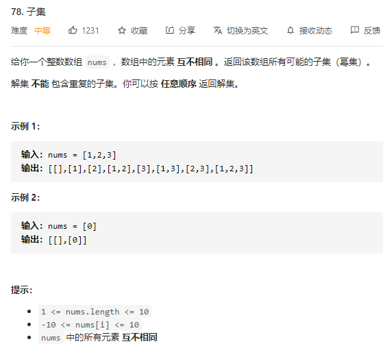

**Idea:**

这题的思想有几个重点：

1）把每一个元素当作一个binary number。如果一个数组有n个元素，那么每个元素只有选(1)或不选(0)，这两个选择。因此，通过乘法规律，就会有2*2*2...*2种可能性(combination) ==》所以共有2^n个可能性。

2）因为我们不知道会有多少个element，所以不知道要用多少个for-loop来遍历，=》因此唯一的办法就是，用递归的思想。用index表示binary tree里的每一层，每traceback一次，index++，直到index == len(nums) 为止，就return。

The intuition is similar to DFS, where you use a stack to collect each possibility in depth first manner, and pop at the end of path.

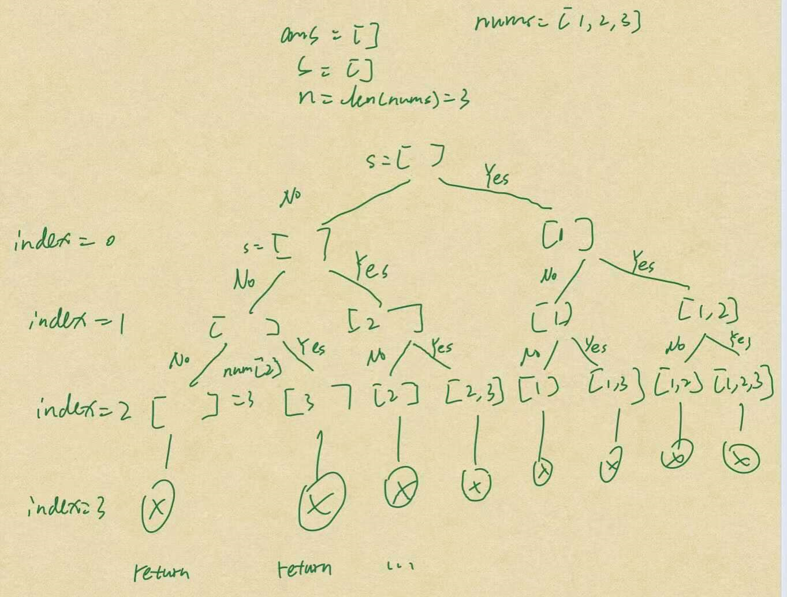

**Python Code:**

```python
class Solution:
    def subsets(self, nums: List[int]) -> List[List[int]]:
        self.ans = []
        self.stack = []
        self.n = len(nums)
        self.traceback(nums, 0)
        return self.ans

# 用recursion的话，一般是通过定义一个函数，然后通过每次放入不同的变量，调用函数来解决其子问题
    def traceback(self, nums: int, index: int):
        print(f"index: {index}, s: {self.stack}")
        if index == len(nums):
            # make a copy and return
            self.ans.append(self.stack[:])
            return
        # 不选（0）：
        self.traceback(nums, index+1)
        
        # 选（1）
        self.stack.append(nums[index])
        self.traceback(nums, index+1)
        self.stack.pop()
```

Java Code 

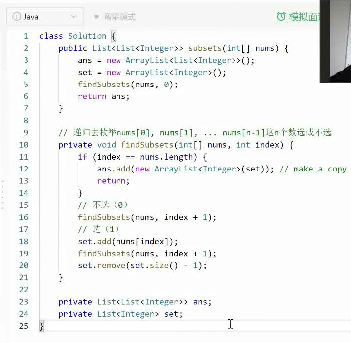

时间复杂度分析：
$$
T(n) = 2T(n-1) + C	\\
	= C + 2^2T(n-2)	\\
	= ...\\
	= C+ 2^nT(1) ==> O(2^n)
$$
**==Idea2:== ** 

这题还有另外一种方法来实现回归。之前是通过把每一个元素当成二叉树支点来看，每个点只能有两个node，然后最后形成的是一个completed binary tree。但我们其实可以在中间加一个for-loop的，这样就不限制与binary case了，具体可以参考这里，https://leetcode-cn.com/problems/subsets/solution/hui-su-si-xiang-tuan-mie-pai-lie-zu-he-zi-ji-wen-t/


Code:

```python
class Solution:
    def subsets(self, nums: List[int]) -> List[List[int]]:
        self.ans = []
        self.stack = []
        self.traceback(nums, 0)
        return self.ans
    
    def traceback(self, nums: List[int], startIndex: int):
        print(f"index: {startIndex}, s: {self.stack}")
        self.ans.append(self.stack[:])
        for i in range(startIndex, len(nums)):
            self.stack.append(nums[i])
            self.traceback(nums, i+1)
            self.stack.pop()
```


#### !!! 77 组合

- 77 组合, https://leetcode-cn.com/problems/combinations/submissions/

**Question:**

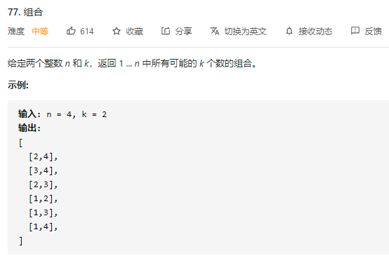

**Idea:**

I feel I have a much better grip for idea2, so the idea2 was used to implement this question.


Python Code:

```python
class Solution:
    def combine(self, n: int, k: int) -> List[List[int]]:
        self.ans = []
        self.stack = []
        self.traceback(n, k, 0)
        return self.ans 

    # combination is a special case of permutation. just need a bit of changes to the condition statement
    def traceback(self, n: int, k: int, startIndex: int):
        if len(self.stack)==k:
            self.ans.append(self.stack[:])
            return
        # print(f"index: {startIndex}, s: {self.stack}")
        for i in range(startIndex, n):    #i: [1~3]
            self.stack.append(i+1)
            self.traceback(n, k, i+1)
            self.stack.pop()
```

老师的思路：

```python
class Solution1:
    def combine(self, n: int, k: int) -> List[List[int]]:
        """
            方法一：暴力枚举
        """
        # if k==1:
        #     return [[i+1] for i in range(n)]
        # ans = []
        # for i in range(n):
        #     for j in range(n):
        #         if j>i:
        #             ans.append([i+1, j+1])
        #             print(i+1, j+1)
        # return ans

        '''
            方法二：Recusion
        '''
        self.ans = []
        self.stack = []
        self.nums = list(range(1, n+1)) # nums: [1, 4], index: [0, 3]
        self.traceback(n, k, 0)
        return self.ans 

    # combination is a special case of permutation. just need a bit of changes to the condition statement: 不同之处就在于，在节点处需要收集的信息。
    def traceback(self, n: int, k: int, index: int):
        # 达不到要求的情况：stack长度本身超过了k（也没满足我们想要的), 或者，stack长度本身再加上剩下的数也不够k个，就可以退出了
        if len(self.stack)>k or len(self.stack) + n-index+1<k:
            return 
        if index == n:
            self.ans.append(self.stack[:])
            return   

        # No
        self.traceback(n, k, index+1)
        # Yes
        self.stack.append(self.nums[index])
        self.traceback(n, k, index+1)
        self.stack.pop()

```


#### !!! 46 全排列

- 46 全排列， https://leetcode-cn.com/problems/permutations/

Question:

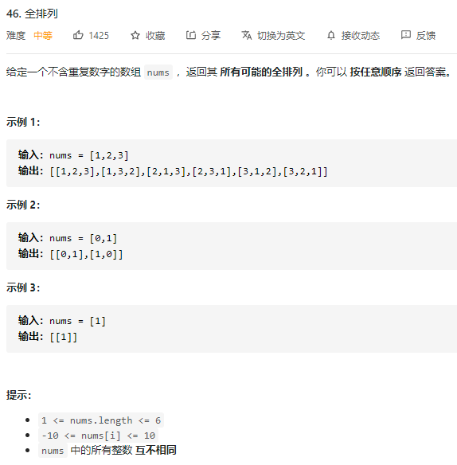

**Idea:**

首先排列是有序的，也就是说[1,2] 和[2,1] 是两个集合，这和之前分析的子集以及组合所不同的地方。可以看出元素1在[1,2]中已经使用过了，但是在[2,1]中还要在使用一次1，所以处理排列问题就不用使用startIndex了。但排列问题需要一个used数组，标记已经选择的元素，如图橘黄色部分所示:


– Reference, 

- 「代码随想录」46. 全排列【回溯算法经典题目】详解, https://leetcode-cn.com/problems/permutations/solution/46-quan-pai-lie-hui-su-suan-fa-jing-dian-ti-mu-xia/

- 「代码随想录」78. 子集:【回溯搜索法】经典题目详解！, https://leetcode-cn.com/problems/subsets/solution/dai-ma-sui-xiang-lu-78-zi-ji-hui-su-sou-6yfk6/
- 「代码随想录」回溯法经典题目【组合问题】深度剖析！, https://leetcode-cn.com/problems/combinations/solution/77-zu-he-hui-su-fa-jing-dian-ti-mu-by-carlsun-2/

- 回溯思想团灭排列、组合、子集问题, https://leetcode-cn.com/problems/subsets/solution/hui-su-si-xiang-tuan-mie-pai-lie-zu-he-zi-ji-wen-t/

Python Code:

```python
class Solution:
    def permute(self, nums: List[int]) -> List[List[int]]:
        '''
        主要思路：
        依次考虑每个位置放哪个数
        “从还没用过的”数种选一个，放在当前的位置 ==》我们需要维护一个“还没有用过的”信息
        '''
        self.nums = nums
        self.ans = []
        self.stack = []
        self.used = [False] * len(nums)    # 每个位置的数是否被用过了
        self.traceback(nums, 0)
        return self.ans

    def traceback(self, nums: List[int], startIndex: int):
        # Decide when to stop
        if startIndex == len(nums):
            self.ans.append(self.stack[:])
            return
        # Traverse over all element for current node
        for i in range(len(nums)): # i: 0~n-1
            if not self.used[i]:    # 如果还没用过
                # 收集当前node需要的信息
                self.used[i] = True
                self.stack.append(nums[i])
                # 回溯
                self.traceback(nums, startIndex+1)
                # 还原
                self.stack.pop()
                self.used[i] = False

# Good reference: 
# https://leetcode-cn.com/problems/permutations/solution/46-quan-pai-lie-hui-su-suan-fa-jing-dian-ti-mu-xia/
```


#### 47. 全排列 II

- 47. 全排列 II, https://leetcode-cn.com/problems/permutations-ii/

**Question:**

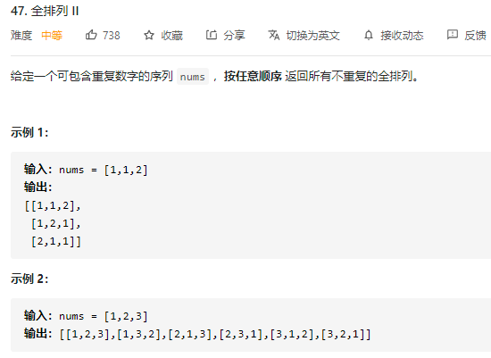

**Idea:** 

The idea is same as question #46, except you need to add those two lines:

```python
if self.stack[:] not in self.ans:
                self.ans.append(self.stack[:])
```

**Code:**

```python
class Solution:
    def permuteUnique(self, nums: List[int]) -> List[List[int]]:
        self.ans = []
        self.stack = []
        self.used = [False]*len(nums)
        self.traceback(nums, 0)
        return self.ans

    # This question is almost exactly same as the 46 全排列, except that we allow duplicated element in the nums
    def traceback(self, nums: List[int], startIndex: int):
        if startIndex == len(nums):
            if self.stack[:] not in self.ans:
                self.ans.append(self.stack[:])
            return
        
        for i in range(len(nums)):
            if not self.used[i]:
                self.used[i] = True
                self.stack.append(nums[i])
                self.traceback(nums, startIndex+1)
                self.stack.pop()
                self.used[i] = False
```


### 回溯基本形式总结：

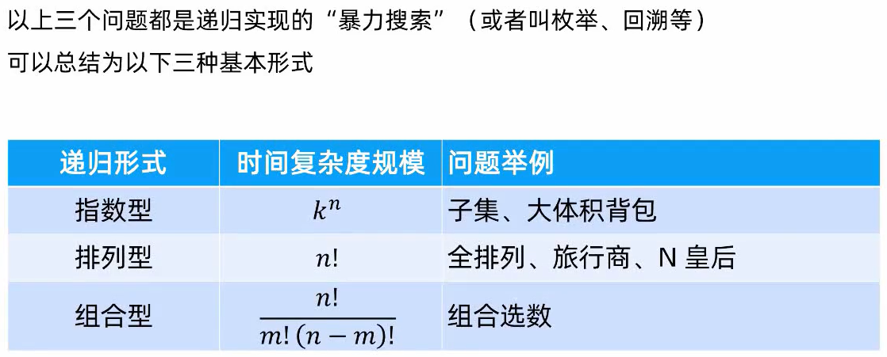


## 树

### What is Binary Tree？

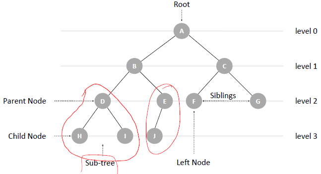


### 实战例题：

#### !!! 226 翻转二叉树

- **226 翻转二叉树**，https://leetcode-cn.com/problems/invert-binary-tree/

**Question:**

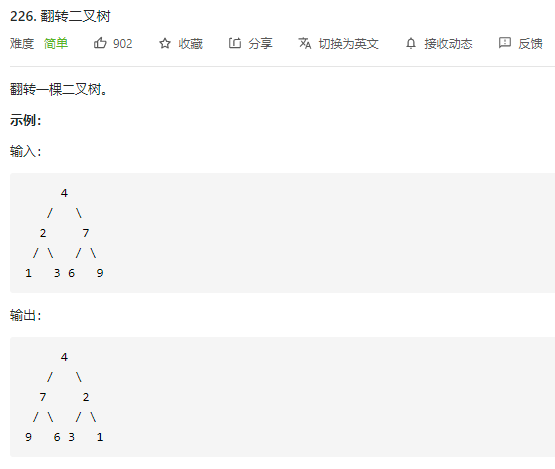

**Idea:**

用的就是递归的思想: 1)先考虑Base case; 2) 然后用递归的方法来解决子问题 ==> 直接看代码清楚些

**Python Code:**

```python
# Definition for a binary tree node.
# class TreeNode:
#     def __init__(self, val=0, left=None, right=None):
#         self.val = val
#         self.left = left
#         self.right = right
class Solution:
    def invertTree(self, root: TreeNode) -> TreeNode:
        # 处理下边界:
        if root == None:
            return
        # 处理左右
        self.invertTree(root.left)
        self.invertTree(root.right)
        # 处理中间
        tempNode = root.left
        root.left = root.right
        root.right = tempNode
        return root
```


#### !! 98 验证二叉搜索树

- 98 验证二叉搜索树，https://leetcode-cn.com/problems/validate-binary-search-tree/

Question:

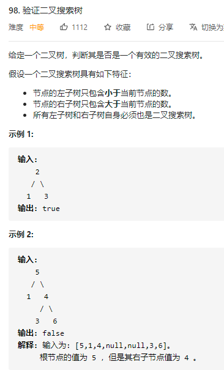

**Idea1:**

**Python Code:**

```python
# 这个思路的重点就是，不重新创立额外的信息，直接在已给的信息上进行计算，个传递。
class Solution3:
    def isValidBST(self, root: TreeNode) -> bool:
        return self.helper(root, None, None)

    def helper(self, root, min_node, max_node) -> bool:
        if root == None:
            return True
        
        if min_node != None and root.val <= min_node.val:
            return False
        if max_node != None and root.val >= max_node.val:
            return False  
        
        return self.helper(root.left, min_node, root) and self.helper(root.right, root, max_node)
# 作者：Booooo_
# 链接：https://leetcode-cn.com/problems/validate-binary-search-tree/solution/yan-zheng-er-cha-sou-suo-shu-bstgei-zi-s-hvgz/


# ================> 老师给的解题思路：老师给的这个就需要自己来维护一个最大和最小值，这些信息使用一个class包裹者的，而且traversed到的每一个node都要创建一次，然后进行计算完了在传给上一层 (因为python 是有自己的garbage collector的，而且这里没有使用任何的shared member/attribute/variables，所以不需要“还原现场”)
class Info:
    def __init__(self, isValid=None, minVal=None, maxVal=None):
        self.isValid = None 
        self.minVal = None
        self.maxVal = None
        
class Solution:
    def isValidBST(self, root: TreeNode) -> bool:
        return self.helper(root).isValid

    def helper(self, root) -> bool:
        if root==None:
            info = Info()
            info.isValid = True
            info.minVal = float('inf')
            info.maxVal = float('-inf')
            return info
        
        left = self.helper(root.left)
        right = self.helper(root.right)
        result = Info()
        result.isValid = left.isValid and right.isValid and left.maxVal < root.val and right.minVal > root.val
        result.minVal = min(min(left.minVal, right.minVal), root.val)
        result.maxVal = max(max(left.maxVal, right.maxVal), root.val)
        return result

```


节点的左子树只包含小于当前节点的数。=> 左子数的最大节点比根小
节点的右子树只包含大于当前节点的数。=> 右子数的最小节点比根大
所有左子树和右子树自身必须也是二叉搜索树。

**Java Code:**

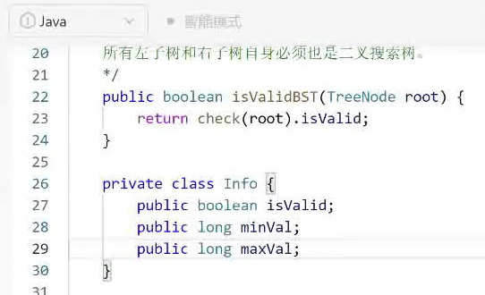

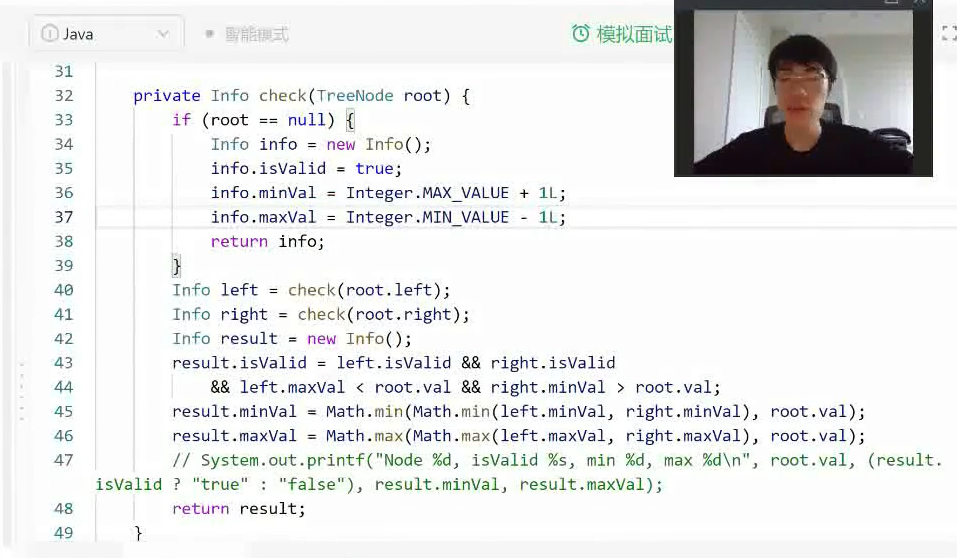


### 二叉树最大/最小深度 

主题思路：

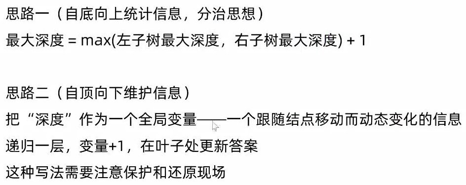

#### 104. 二叉树的最大深度 – Easy

**Question:**

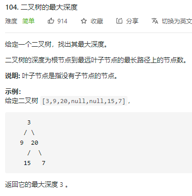

**Python Code:**

```python
# Definition for a binary tree node.
# class TreeNode:
#     def __init__(self, val=0, left=None, right=None):
#         self.val = val
#         self.left = left
#         self.right = right
class Solution:
    def maxDepth(self, root: TreeNode) -> int:
        # 处理边界
        if root == None:
            return 0
        return (max(self.maxDepth(root.left), self.maxDepth(root.right)) + 1)
```

Java Code:

老师的写法一：参数是不共享与所有函数体的，是每个function独有的，所以不用还原、保护现场。但系统会把这些变量压栈(make a copy to new stack)， 会waste a bit of memory.

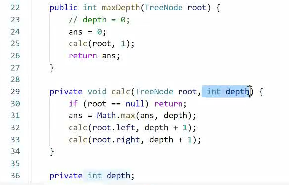

老师的写法二：共享参数。看起来更简洁，但要注意，每次递归后要把现场还原。

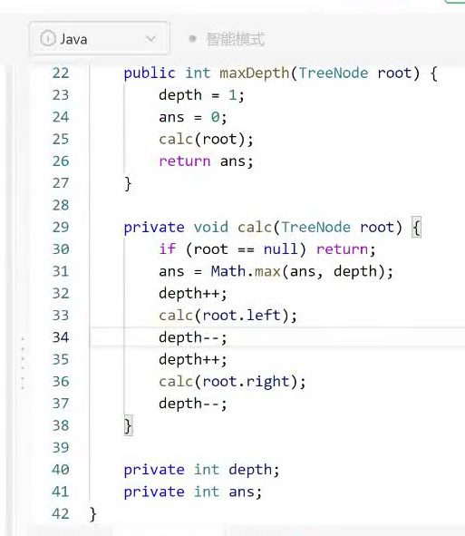

Note: 因为这里没有该class 成员，or global/shared vairable, 所以不需要还原现场。

#### 111. 二叉树的最小深度 – Easy

- 111. 二叉树的最小深度, https://leetcode-cn.com/problems/minimum-depth-of-binary-tree/

Question:

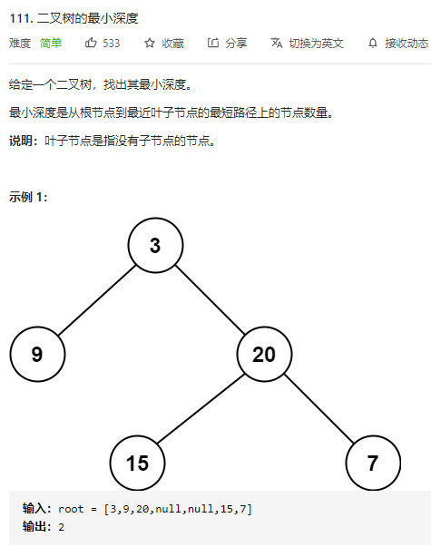

Idea:

Python Code:

```python
# Definition for a binary tree node.
# class TreeNode:
#     def __init__(self, val=0, left=None, right=None):
#         self.val = val
#         self.left = left
#         self.right = right
class Solution:
    def minDepth(self, root: TreeNode) -> int:
        if root == None:
            return 0
        if root.left == None:
            return (self.minDepth(root.right) + 1)
        if root.right == None:
            return (self.minDepth(root.left) + 1)
        return (min(self.minDepth(root.left), self.minDepth(root.right)) + 1)
```


## 分治算法

### 基础知识：

What is Divide and Conquer
