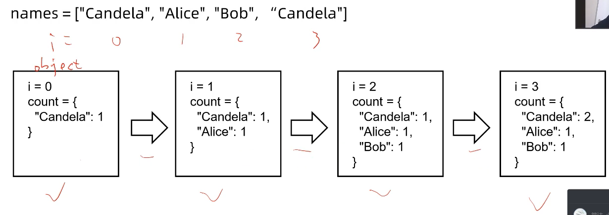
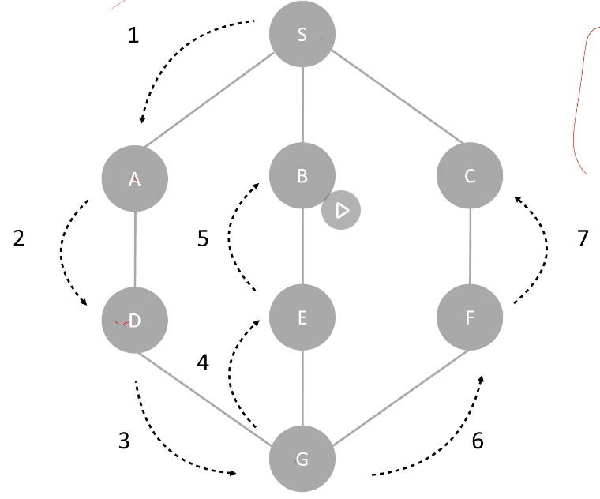
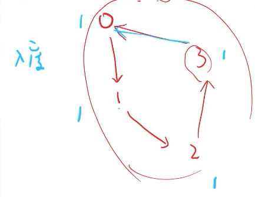
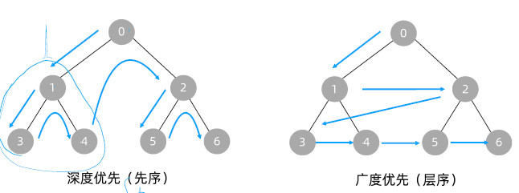
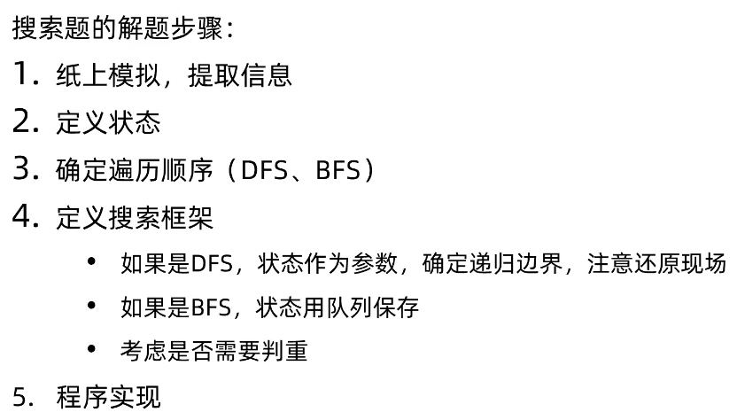
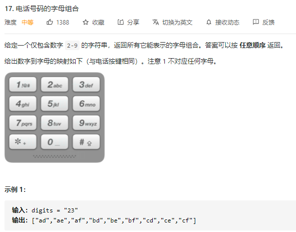
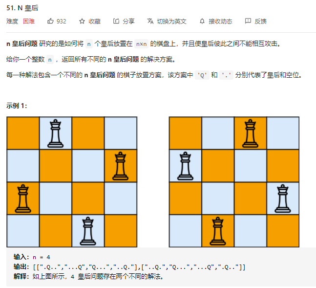
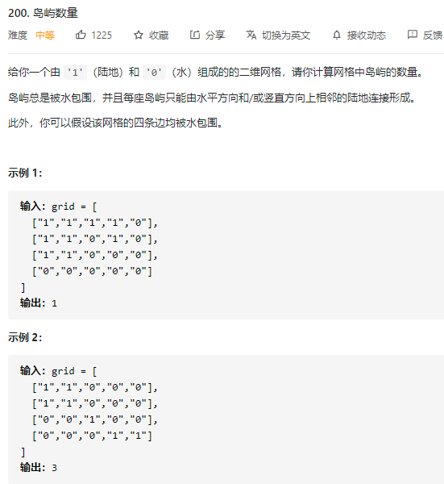
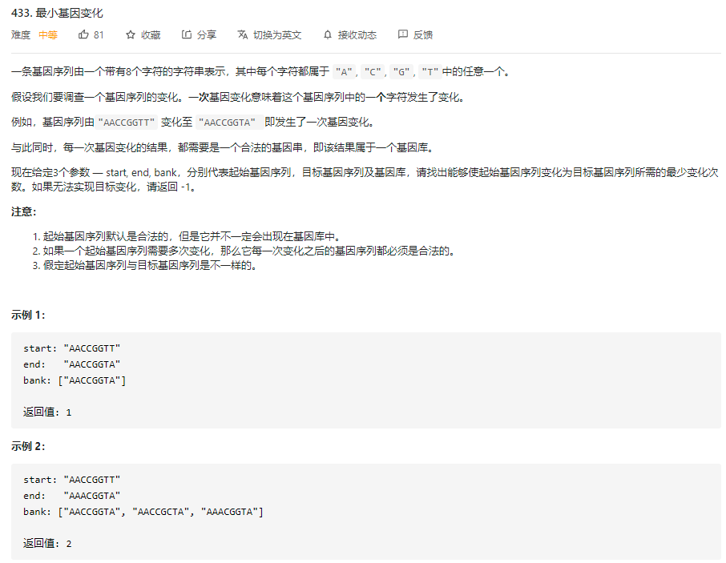
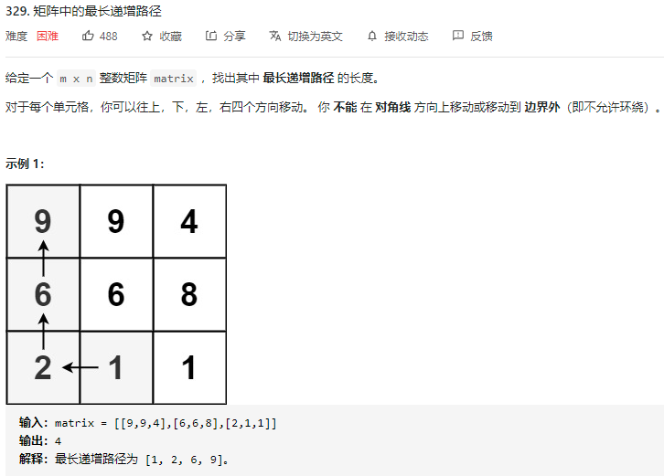

[TOC]
# Class6 深度优先搜索、广度优先搜索


# 本科重点

- 第一次归纳总结状态、状态空间和把问题抽象为树或图的方法
- **搜索是解决一切问题的万金油算法**，众多没有多项式时间解法的问题都需要靠搜索求解
- 学会**定义搜索框架**，将极大地帮助学习**动态规划**和**图论**算法
- 搜索是训练**代码能力**最有效的题目类别
- 图的时间复杂度：O(N+M), where N == 点数, M == 边数

Note: 这节课是前6节里最重要的一节课了


# 1. 状态与状态空间

**什么是状态？**
- 状态就是程序维护的所有动态数据结构的集合
- 题目中涉及的所有数学信息
- 你在纸上人力计算时，关注的所有数据
- 一个函数访问的所有变量

例如最简单的计票问题
- 给n个名字，统计每个名字出现的次数

在纸上画"正"数统计的时候，关注了哪些数据？
- 名字（n个字符串）
- 统计到哪个名字了（第1<=i<=n个名字）
- 画的“正”字（一个用于计数的数据结构，例如hash map）

```C++
// 只关注其中动态变化的数据: i 和 count
for (int i = 0; i < n; i++){
    count[name[i]]++;
}
```
做题时，要注意关注其中==**动态变化的**==数据 （题目给的那些数据是不会变的), e.g., names, n 这些不管怎么计票，这些都是不会变的。

### 如何抽象一个状态变化的问题变成一个图(Graph)?

当一个题目如果很复杂，不清楚如何下手时，下把那些随**着时间变化的数据**抽出来，当成**状态变量**里。做几个实力测试，看看能不能将这些信息合并，简化？

- 每一个时间点，活一次变化，应该会导致一个unique的状态

- 可以把有其他数据决定的信息从状态中排除，得到最简状态，而它就决定了问题的复制度
- 了解状态空间的范围

比如下图，随着i的遍历移动，我们知道这只有4中可能的状态, e..g, 当i==0时，




**状态空间->图**
所有可能状态构成的集合就是一个问题的状态空间

把状态作为点，如果一个状态可以达到另一个状态，就连一条边
这样就把整个状态空间抽象为了一张有向图
对问题的求解，就是对这张图的遍历

计票问题的状态空间由n个状态组成
可以看作一张n个点，n-1条边的有向图
整张图是一条链，自然就可以用一维循环解决了

**状态的简化**
把可以由其他数据决定的信息从状态中排除，得到最简状态决定了问题的复杂度

**指数型状态空间（子集）**


# 2. 深度优先搜索(DFS)的实现与应用

## 什么是图的深度优先遍历？

Note: 需要画图来理解

- 需要一个来记录每个点是否访问过的数据结构，可以是a hashMap<pair<node.val: int, visited: bool>>, or a list<int\> 
- 


# 3. 广度优先搜索(BFS)的实现与应用

什么是图的广度优先遍历？

- 基于一个队列来实现的，要维护一个先进先出的顺序
- 在无向图里，为了避免重复访问，都要开一个visited[bool]数组

BFS可以实现有向图的找环：

- 首先要理解“度数”： 如下图所示，0的入度是1，1的入度是1，。。。，3的入度是1，==》 因此就可以用“入度”来判断是否有环
  - 
  - 


# 4. DFS与BFS的对比



何时取舍DFS? or BFS?

- DFS 更适合搜索树形状态空间的题，因为
  - 递归本身就会产生树的结构
  - 可以用一个全局变量来维护状态中较为复杂的信息（例如：子集方案，排列方案）
  - 不需要队列，节省空间 （其实dfs是利用了compiler或系统里的stack，来帮我们维护空间）
- BFS适合求“最小代价”, “最少步数”这类型的题目
  - BFS是按层次序搜索，第k步搜完才会搜k+1步，在任意时刻队列中至多只有两层
- 在状态空间为一般的“图”， 或者拓扑搜索时，DFS和BFS没有区别 ==》 按个人喜欢来选就行了


## 蛮力搜索的解题步骤




# 实战案例

## DFS、BFS

### [电话号码的字母组合](https://leetcode-cn.com/problems/letter-combinations-of-a-phone-number/)（Medium）

Question:



Idea:

这题用的就是dfs的思路 ==》 复习下之前子集 回溯解法的模板就能写出来了

Python Code:

```python
class Solution:
    """
        方法一：用DFS搜索
    
    """
    def letterCombinations(self, digits: str) -> List[str]:
        if len(digits) == 0:
            return []
        edges = {}
        edges['2'] = "abc"
        edges['3'] = "def"
        edges['4'] = "ghi"
        edges['5'] = "jkl"
        edges['6'] = "mno"
        edges['7'] = "pqrs"
        edges['8'] = "tuv"
        edges['9'] = "wxyz"
        self.edges = edges
        self.ans = []
        self.str = ""
        self.dfs(digits, 0)
        return self.ans

    def dfs(self, digits, index):
        # Base case:
        if len(digits) == len(self.str):
            self.ans.append(self.str)
            return
        
        for ch in self.edges[digits[index]]:
            self.str += ch
            self.dfs(digits, index+1)
            self.str = self.str[:-1]
```


### [ N 皇后](https://leetcode-cn.com/problems/n-queens/)（Hard）

Question:



Idea:

这题的核心思路就是用回溯递归树搜索的算法，每一行里每一格的位置都遍历一遍，找出所有符合规定的布局方式。

这题考查的点有两个：

​      1）能把题目抽象成图论问题，然后用搜索算法找出所有的可能性

​      2） 知道如何判断结果的合法性，换而言之，就是知道用什么条件来决定path里有我们要的答案 ==> 这题trick的地方就在如何判断两点是否在同一斜线上？

Python Code

```python
```

### [岛屿数量](https://leetcode-cn.com/problems/number-of-islands/)（Medium）

Question:



Idea:

Python Code:

```python
class Solution:
        # 之前有人问：图里面有孤立点怎么办？或者又不连通的点怎么办？==》 这题就是个例子，就是要找有几座岛屿，或者几个连通块
    def numIslands(self, grid: List[List[str]]) -> int:
        """
            方法一：dfs
            题目给了一个矩阵，1就代表陆地，目的就是要找出给的矩阵里有多少个连通块。
            思路：建立一个同样大小的 visited: list<list<bool>>, true就代表访问过了，false就没有。从第一个格开始，把矩阵里的每一个点都过一遍。如果当前点没有被访问过，从他开始做dfs。dfs里把所有相连的点都标记true，就是访问过了的意思。然后ans++
            2) 知道如何用dfs来遍历所有的点
        """
        # 初始visited 矩阵来记录访问过的点
        m = len(grid)
        n = len(grid[0])
        self.visited = [[False]  * len(grid[0]) for i in range(len(grid))]
        # print(f"self.visited: {self.visited}")

        # 定义方向：复习机器人那题
        self.dx = [0, 1, 0, -1] # N->E->S->W 从上开始，正时针旋转一圈
        self.dy = [1, 0, -1, 0]

        # 需要返回的答案
        ans = 0
        
        for i in range(m):
            for j in range(n):
                if grid[i][j]=="1" and self.visited[i][j]==False:
                    self.bfs(grid, i, j)
                    ans+=1
        return ans

        
    def dfs(self, grid, x: int, y: int):
        # 这题不需要考虑吧终止条件，因为当所有的点都走过了，就没有下一个点可走以后，就会停止，返回了
        self.visited[x][y] = True
        for i in range(4):
            nx = self.dx[i] + x
            ny = self.dy[i] + y
            # 任何时候访问数组，一定要记得判读合法性，是否越界
            if nx < 0 or ny < 0 or nx >= len(grid) or ny >= len(grid[0]):
                continue
            if grid[nx][ny]=="1" and self.visited[nx][ny]==False:
                self.dfs(grid, nx, ny)

        # 什么时候走呢？==》 只有当岛上的点为1，且没有走过

    def bfs(self, grid, x: int, y: int):
        queue = collections.deque()
        queue.append([x, y])
        self.visited[x][y] = True
        while queue:
            cur_point = queue.popleft()
            cur_x, cur_y= cur_point[0], cur_point[1]
            for i in range(4):
                nx = self.dx[i] + cur_x
                ny = self.dy[i] + cur_y
                if nx < 0 or nx >= len(grid) or ny < 0 or ny >= len(grid[0]):
                    continue
                if grid[nx][ny]=="1" and self.visited[nx][ny] == False:
                    queue.append([nx, ny])
                    self.visited[nx][ny] = True

# Note1: BFS 是入队后标记visited，而DFS是递归开始时标记visited
```


### [最小基因变化](https://leetcode-cn.com/problems/minimum-genetic-mutation/)（Medium）

Question:



Idea:

Python Code:

```python
class Solution:
    def minMutation(self, start: str, end: str, bank: List[str]) -> int:
        # 节点数 4^8 = 2^16 = 65536 
        # ==> now, with the limitation, the search space reduce to len(bank)
        # 你可以无数次的变化，在变到正确的基因，但这题要求找变化次数最少的一种方式

        # Note1：start其实就是root node，那需要先考虑他每个点的出变数：8 * 3， 8是因为字符串的长度是8，而每一个字符串有4种可能, ACGT, 但我们要排除他自己当前的情况，所以每个点就有24条出边数。
        # Note2: search space ==> 节点数 * 出变数 = (4^8) * 24 ==> 这就是我们的搜索空间的大小


        # Why need a depth as hashmap? ==> 需要一个映射来存每个点的层数 
        depth = collections.defaultdict(int)    # map<key: str, val: int>
        depth[start] = 0

        queue = collections.deque()
        queue.append(start)

        GENE_CODE = ("A", "C", "G", "T")
        GENE_LENGTH = 8
        GENE_CODE_LEN = 4

        while queue:

            cur_str = queue.popleft()

            for i in range(GENE_LENGTH):
                for j in range(GENE_CODE_LEN):
                    if cur_str[i] == GENE_CODE[j]:
                        # print(f"cur_str[i]: {cur_str[i]}")
                        continue
                    # move to next string: by mutation the gene, or by replaing the gene code
                    next_str = cur_str[:i] + GENE_CODE[j] + cur_str[i+1:]
                    # print(f"cur_str: {cur_str}, next_str: {next_str}")
                    # 判断是否visited?
                    if next_str in depth:
                        continue
                    if next_str in bank:
                        queue.append(next_str)
                        depth[next_str] = depth[cur_str]+1
                        if next_str == end:
                            return depth[next_str]
        # print(f"depth: {depth}")
        return -1
```


C++ Code:

```C++
class Solution {
public:
    int minMutation(string start, string end, vector<string>& bank) {
        // 点数：4^8 = 2^16 = 65536
        unordered_set<string> bankSet;
        for (string& s : bank) bankSet.insert(s);
        // 常数数组
        const char gene[4] = {'A', 'C', 'G', 'T'};
        unordered_map<string, int> depth;
        queue<string> q;
        q.push(start);
        depth[start] = 0;
        while (!q.empty()) {
            // 取队头
            // s = "AACCGGTT"
            // ns = "AACCGGTA" or "AACCGGTC", ... 24种
            string s = q.front();
            q.pop();
            // 24条出边：位置（8种）* 变化成的字符（3种）
            // s[i]变成gene[j]
            for (int i = 0; i < 8; i++)
                for (int j = 0; j < 4; j++) {
                    if (s[i] == gene[j]) continue;
                    string ns = s;
                    ns[i] = gene[j];
                    // 如果bank里没有ns，说明ns不合法（不在库中），跳过
                    if (bankSet.find(ns) == bankSet.end()) continue;
                    // 走从s到ns的边
                    // depth里面没有contains字符串ns
                    if (depth.find(ns) == depth.end()) {
                        depth[ns] = depth[s] + 1;
                        q.push(ns);
                        if (ns == end) {
                            return depth[ns];
                        }
                    }
                }
        }
        return -1;
    }
};
```


### [矩阵中的最长递增路径](https://leetcode-cn.com/problems/longest-increasing-path-in-a-matrix/)（Hard）

Question:



Idea:

Python Code:

```python
class Solution1:
    # 思路：这题的重点是要开的出来，这是一个有向无环图。也就是说如果相邻的两个单元格的值不相等，则在相邻的两个单元格之间存在一条从较小值指向较大值的有向边。==》 这样的话，可以用一个记忆矩阵来记录每个点的最大值。问题转化成了在有向图中寻找最长路径。
    def longestIncreasingPath(self, matrix: List[List[int]]) -> int:
        self.dx = [0, 1, 0, -1]
        self.dy = [1, 0, -1, 0]

        m = len(matrix)
        n = len(matrix[0])
        self.dx = [0, 1, 0, -1]
        self.dy = [1, 0, -1, 0]

        m = len(matrix)
        n = len(matrix[0])
        self.memory = [[-1]*n for i in range(m)]

        self.max_len = 1
        for i in range(m):
            for j in range(n):
                self.max_len = max(self.max_len, self.dfs_with_memory(matrix, i, j))

        return self.max_len

    # 如果只是光用dfs是不行的 ==》 提交后你会提交时间超时的 ==》 所以还是需要用dp的思想，要有一个记忆矩阵来记住当前的最大长度，避免重复计算
    def dfs_with_memory(self, matrix, x: int, y: int):
        # 算过了的地方，就直接放回
        if self.memory[x][y] != -1:
            return self.memory[x][y]
        # 如果一开始就走不下去，至少也算一步
        local_max = 1
        # 四个方向的遍历
        for i in range(4):
            nx = self.dx[i] + x
            ny = self.dy[i] + y
            # 检查下是否越界
            if nx < 0 or nx >= len(matrix) or ny < 0 or ny >= len(matrix[0]):
                continue
            # 检查是否符合题目要求
            if matrix[nx][ny] > matrix[x][y]:
                local_max = max(local_max, self.dfs_with_memory(matrix, nx, ny)+1)
        self.memory[x][y] = local_max
        return local_max
```


Java Code:

```java
class Solution {
    public int longestIncreasingPath(int[][] matrix) {
        m = matrix.length;
        n = matrix[0].length;
        answer = new int[m][n];
        for (int i = 0; i < m; i++)
            for (int j = 0; j < n; j++)
                 answer[i][j] = -1;
        //    U   L  R  D
        dx = new int[]{-1, 0, 0, 1};
        dy = new int[]{0, -1, 1, 0};
        int ans = 0;
        for (int i = 0; i < m; i++)
            for (int j = 0; j < n; j++)
                ans = Math.max(ans, howFar(matrix, i, j));
        return ans;
    }

    // 子问题：从(x,y)出发能走多远
    // x：行号，y：列号
    int howFar(int[][] matrix, int x, int y) {
        // 算过了，直接返回（只算一次）
        if (answer[x][y] != -1) return answer[x][y];
        // 走不动了，至少是1
        answer[x][y] = 1;
        // 四个方向
        for (int i = 0; i < 4; i++) {
            int nx = x + dx[i];
            int ny = y + dy[i];
            if (nx < 0 || ny < 0 || nx >= m || ny >= n) continue;
            if (matrix[nx][ny] > matrix[x][y]) {
                answer[x][y] = Math.max(answer[x][y], howFar(matrix, nx, ny) + 1);
            }
        }
        return answer[x][y];
    }

    int m;
    int n;
    int[] dx;
    int[] dy;
    int[][] answer;
}
```