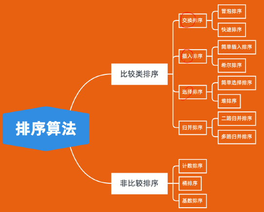
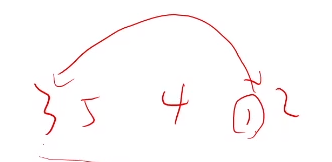
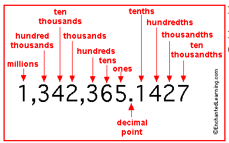
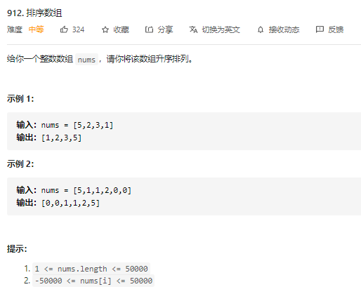
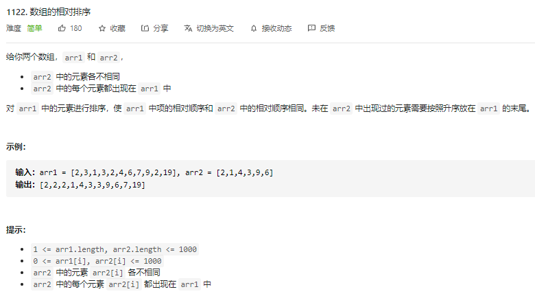

[TOC]

# Outline:



1. 基于比较的各类排序算法

- 基于比较的排序：通过比较大小来决定元素间的相对次序。可以证明这类排序算法的时间复杂度下届为O(log(N)) – 不可能更快了的
- 非比较类排序：本质就是不通过比较元素的大小来决定排列的顺序，而是通过？？？？ 因此时间复杂度受多种因素影响，不单取决于N元素数量N

2. 其它类型的排序算法，不同排序算法的适用场景


2. 第K大的数，中位数，逆序对等应用


# 

# 初级排序算法：选，插，冒

### 选择排序（Slelection Sort) 

**Idea：**

“该放那个数了？” ==》 每次扫描一遍序列，找到当前的min，然后放到新的序列末尾。 ==> 或者，为了省空间，你也可以不用开一个新的数组，就swap currnet index i 和当前的min



### 插入排序(Insertion Sort)

**Idea:**

“这个数该放哪儿？” ==》 就有点像打扑克牌，你抽牌的时候，要考虑新的一张牌应该放哪儿呢？–》 平均时间复杂度为O(N^2), 因为每一张牌都需要查询 – O(N)，和插入 – O(N)


### 冒泡排序(Bubble Sort)

**Idea:**

思路就是不断循环扫描，每次查看相邻的元素，如果你序列了，就交换他们的位置。Bubble Sort is the simplest sorting algorithm that works by repeatedly swapping the adjacent elements if they are in wrong order.  ==> 你如果从前往后扫描，那最大的元素就会被带到最后，打你如果从后往前扫描，那最小的元素就会被带到前面，思路都是一样的

**Example:** 
==> **First Pass:** we are starting from first to the end, so by the end of first round, the largest element will be carry to the end. 最大的数就像泡泡一样，会带到最后一位
( **5** **1** 4 2 8 ) –> ( **1** **5** 4 2 8 ), Here, algorithm compares the first two elements, and swaps since 5 > 1. 
( 1 **5** **4** 2 8 ) –> ( 1 **4** **5** 2 8 ), Swap since 5 > 4 
( 1 4 **5** **2** 8 ) –> ( 1 4 **2** **5** 8 ), Swap since 5 > 2 
( 1 4 2 **5** **8** ) –> ( 1 4 2 **5** **8** ), Now, since these elements are already in order (8 > 5), algorithm does not swap them.
==> **Second Pass:** The second largest element will be carry to the end
( **1** **4** 2 5 8 ) –> ( **1** **4** 2 5 8 ) 
( 1 **4** **2** 5 8 ) –> ( 1 **2** **4** 5 8 ), Swap since 4 > 2 
( 1 2 **4** **5** 8 ) –> ( 1 2 **4** **5** 8 ) 
( 1 2 4 **5** **8** ) –> ( 1 2 4 **5** **8** ) 
Now, the array is already sorted, but our algorithm does not know if it is completed. The algorithm needs one **whole** pass without **any** swap to know it is sorted.
==> **Third Pass:** 
( **1** **2** 4 5 8 ) –> ( **1** **2** 4 5 8 ) 
( 1 **2** **4** 5 8 ) –> ( 1 **2** **4** 5 8 ) 
( 1 2 **4** **5** 8 ) –> ( 1 2 **4** **5** 8 ) 
( 1 2 4 **5** **8** ) –> ( 1 2 4 **5** **8** ) 

```python
# Python program for implementation of Bubble Sort
def bubbleSort(arr):
    n = len(arr)
    # Traverse through all array elements
    for i in range(n):
        # Last i elements are already in place
        for j in range(0, n-i-1):
            # traverse the array from 0 to n-i-1
            # Swap if the element found is greater
            # than the next element
            if arr[j] > arr[j+1] :
                arr[j], arr[j+1] = arr[j+1], arr[j]
 
# Driver code to test above
arr = [64, 34, 25, 12, 22, 11, 90]
bubbleSort(arr)
print ("Sorted array is:")
for i in range(len(arr)):
    print ("%d" %arr[i]),
```

- Reference: GeeksforGeeks, Bubble Sort， https://www.geeksforgeeks.org/bubble-sort/


## 快排（QuickSort)

First we need to know QuickSort is a great algorithm, it’s not stable, but it gurantee the time complexity is O(log(N)). It’s very effective

**Idea:** 

Step1：Parition the list – moving all element smaller than pivot to left side, and all lelements greater than pivot to right side. 

Pick a pivot p, and instantiate two pointer, left and right. ==> The process is similar to two pointers algorithm, and the goal is to filter all elements, nums[i] < nums[p], to the left side of pivot number, and put all elements greater than pivot to the right side of pivot. 

```python

while left < right:
        # For left index: When this stop moving, we know there is a number should be move to right side of pivot
    while nums[left] < nums[pivot]:
        left += 1
    # For Right index: When this stop moving, we know there is a number should be move to left side
    while nums[right] > nums[pivot]:
        right -= 1
    # When they both stop, moving, we need to make a swap. And Notive, we always need to check whether the index is accessible
    if left < right:
        nums[left], nums[right] = nums[right], nums[left]
        left += 1
        right -= 1
```

==> Since each time, we need to go over the while list once, so this requires at O(N) time complexity.

Step 2:  

Use a while loop to tracking the position of left and right pointer.


Hoare Partition Animation: https://www.bilibili.com/video/BV1q64y1S7Ax

- left index keep moving to the left, and right index keep moving to the right 
- when they both stop, then it’s a time to perfrom swap
- Keep doing this, until left == rigth
- At that time, we will swap the last element with pivot


## 排序算法的稳定性问题


## 非比较类排序算法

### 计数排序(Counting Sort)

**使用要求：**

计数排序要求输入的数据必须是有确定范围的整数。

需要用到Map，Or HashTable

==》 适合小范围内的排序


**Idea:** 

将输入的数据作为key存储在额外的数组中，然后依次把计数大于1的填充回原数组。

For example; we have a list, nums = [3 3 5 4 1 2], and we know 1< nums[i] < 1000

Then we need to make a counter for each value, such than we have things like

```python
counter = [0 1 1 2 1 1]	# counter[i] represent the number of time a element occurred
		   0 1 2 3 4 5	
```


Then we first can creat a map, with 1000 bucket on it. Traverse through nums, and each time we just need to increment the counter for corresponding value, e.g.,

```python
counter = [0] * len(nums)
# 开始计数
for i in range(len(nums)):
    counter[i] += 1
# T(N) = O(N), where N is len(nums)

result = []
for i in range(len(counter)):
    if i != 0:
        result += [i * counter[i]]
# T(N) = O(M), where M is the range of nums[i]   
```


**Time Complexity:**

O(N+M), N is the number of elements, and M is the range of value, or it’s domain.


### 桶排序(Bucket Sort)

**使用要求：**


**Idea:**

桶排序假设输入数据服从均匀分布，将数据分到有限数量的桶里，每个桶再分别排序(有可能使用别的排序算法，或是以递归方式继续使用桶排序)

桶排序就是一个思想，不用管的

**Time Complexity:** O(N) ~ O(N^2)


### 基数排序（Radix Sort):

**使用要求：**


**Idea:** 

基数排序把数据切割成一位位数字(0-9), 从低位到高位，对每一位分别进行计数排序

就是 比如, we have a list, nums = [125479, 234217, 126814]

We start compairing the least significant number(lst), or last digit, then we have things like 

nums = [126814, 234217, 125479]

==> Then comparing the tens digit for each element, then we should have things like:

nums = [126814, 234217, 125479]

==> And then all the way to its left



```text
126814, 234217, 125479

按个位

按百位
```

什么叫保持相对顺序的排？比如当千位排好了，那在排万位时就，如果两个数相同，那就要按照千位的顺序来排，就是不要动它就行了。

**Time Complexity:** O(NK), K 为数字位数


**Summary：**

这三个非比较累排序算法里，都大概了解思路就行了，唯一可能会用到的就是计数排序(counting sort), 因为在数字比较小的时候，它的效率还是很乐观的。


# 实战例题

## 排序

### [排序数组](https://leetcode-cn.com/problems/sort-an-array/)（Medium

- [排序数组](https://leetcode-cn.com/problems/sort-an-array/)（Medium）半年内出题频次：

| Facebook | 字节跳动 | Amazon | 腾讯 |
| :------: | :------: | :----: | :--: |
|    2     |    12    |   6    |  2   |

| 滴滴 |
| :--: |
|  2   |

Question:



Idea:


Python Code:

```python
class Solution1:
    # 这个实现方法用到了Python's syntax sugar. The idea is the divide and conquer. Each time, we pick middle element(or random), and we put those number smaller thhat pivot in a group/List, and those number greater than pivot in a List, and concatenate them together at the end. ==> We recursively calling on left/smaller and right/greater group, until only one element left. 
    # ==> This implementation required to create a new List, so has some space cost
    def sortArray(self, nums: List[int]) -> List[int]:
        return self.quickSort(nums)

    def quickSort(self, nums):
        if len(nums)<=1:
            return nums

        pivot = nums[len(nums)//2]
        middle = [i for i in nums if i == pivot]
        left = [i for i in nums if i < pivot]
        right = [i for i in nums if i > pivot]
        return self.quickSort(left) + middle + self.quickSort(right)

        
class Solution2:
    # This implementation won't need extra space. That's is, we will sort list in-place.
    def sortArray(self, nums: List[int]) -> List[int]:
        self.quickSort(nums, 0, len(nums)-1)
        return nums

    def quickSort(self, nums: List[int], l: int, r: int):
        if l >= r:
            return
        pivot = self.partition(nums, l, r)
        self.quickSort(nums, l, pivot)
        self.quickSort(nums, pivot+1, r)
        
    def partition(self, nums, l, r):
        pivot = random.randint(l, r)
        pivotVal = nums[pivot]  # 这一条不可以省掉，因为num[pivot]在while的过程中会变的呀，必须提前记录下来
        # print(f"nums: {nums}")
        # print(f"pivot: {pivot}")
        # left index keep moving to the left, and right index keep moving to the right, when they both stop, then it’s a time to perfrom swap
        while l <= r:
            while nums[l] < pivotVal:
                l += 1
            while nums[r] > pivotVal:
                r -= 1
            # That means l and r cannot be moved any further, so we need to make a swap
            print(f"nums: {nums}")
            print(f"Stop when l: {l}, r: {r}")
            if l <= r:
                nums[l], nums[r] = nums[r], nums[l]
                l += 1
                r -= 1
                print(f"l: {l}, r: {r}, pivot: {pivot}")
        # 最后这个中枢值(pivot)不需要交换， 因为可以随机选然后跟着一起排，正因为这样那个位置的值会变，所以要提前记录下来; 也因为这样，所以while loop and 最后的if condition 里用的是 <=
        return r


class Solution:
    def sortArray(self, nums: List[int]) -> List[int]:
        self.mergeSort(nums, 0, len(nums)-1)
        return nums
    
    # mergerSort的思想就是分治算法，假设左边排好了，右边也拍好，那最后就直接merge就完了。 ==》 至于左边右边是怎么排好的，上层思维不用管，merge里都会完成的。你可以假设几个edge case e.g., nums=[4,3],然后带进mergeSort里看看，你会发现 merge() 里会把 [3] and [4] 两个按顺序排好的
    def mergeSort(self, nums, left, right):
        if left >= right:
            return
        mid = (left+right)//2
        self.mergeSort(nums, left, mid)
        self.mergeSort(nums, mid+1, right)
        self.merge(nums, left, mid, right)
    
    def merge(self, nums, left, mid, right):
        # 这用的就是two pointer 的思想，i 从第一段的头开始(也就是left)，j从第二段的头开始(也就是mid+1), 两个prt 一起向后移动，每一步，就把相对较小的那一个存起来，放到temp里。最后看看是哪一个指针还没有结束，说明剩下的都是比另一半要大的数(因为这一步时，我们是假设左右两端都是排到顺序的数组)，然后直接append到temp最后就完了。
        temp = []
        i = left
        j = mid + 1
        while i <= mid and j <= right:
            if nums[i] <= nums[j]:
                temp.append(nums[i])
                i+=1
            else:
                temp.append(nums[j])
                j+=1
        while i<= mid:
            temp.append(nums[i])
            i+=1
        while j<= right:
            temp.append(nums[j])
            j+=1
        nums[left:right+1] = temp
    # 这是老师给的模板

```

### [数组的相对排序](https://leetcode-cn.com/problems/relative-sort-array/)（Easy)

- [数组的相对排序](https://leetcode-cn.com/problems/relative-sort-array/)（Easy）半年内出题频次：

| Amazon |
| :----: |
|   3    |

Question:



Idea:


Python Code:

```python
class Solution:
    def relativeSortArray(self, arr1: List[int], arr2: List[int]) -> List[int]:
        """
        方法一：计数排序
        这题arr[i]的范围很小，1000以内，所以很适合计数排序
        """
        counter = [0] * 1001
        for i in range(len(arr1)):
            counter[arr1[i]] += 1
        # print(counter)
        # [2,3,1,3,2,4,6,7,9,2,19]
        # counter = [0 1 3 2 1 0 1 1 0 1 0....]
        #            0 1 2 3 4 5 6 7 8 9 10
        result = []
        for i in arr2:
            result += [i] * counter[i]
            counter[i] = 0

        # 剩余的，在arr2中未出现过的，按照升序放在 arr1 的末尾
        for i in range(len(counter)):
            if counter[i]!=0:
                result += [i]*counter[i]
        
        return result
    
    # Q: counter能否用hashMap 来实现？==》这题可以，但一般的题目不行，因为，hashMap的没有维护顺序。你最后复原到结果的时候，你需要数组index的顺序来还原。这题是要求你按照arr2的相对顺序，所以可以用，但一般情况下是不会给的，但也不一定总是按照index，正整数的顺序来排，所以还是要看题目来定。
```


### [合并区间](https://leetcode-cn.com/problems/merge-intervals/)（Medium）

- [合并区间](https://leetcode-cn.com/problems/merge-intervals/)（Medium）半年内出题频次：

| Facebook | 字节跳动 | 微软 | Amazon |
| :------: | :------: | :--: | :----: |
|    56    |    25    |  19  |   36   |

| Apple | Bloomberg | Google | eBay |
| :---: | :-------: | :----: | :--: |
|  18   |    16     |   14   |  5   |

| Cisco | Twitter |
| :---: | :-----: |
|   4   |    3    |

Question:


Idea:


Python Code:


### [数组中的第 K 个最大元素](https://leetcode-cn.com/problems/kth-largest-element-in-an-array/)（Medium）

- [数组中的第 K 个最大元素](https://leetcode-cn.com/problems/kth-largest-element-in-an-array/)（Medium）半年内出题频次：

| Facebook | 字节跳动 | 微软 | Amazon |
| :------: | :------: | :--: | :----: |
|    55    |    30    |  9   |   25   |

| 高盛集团 | LinkedIn | Google | 腾讯 |
| :------: | :------: | :----: | :--: |
|    7     |    6     |   7    |  10  |

| Shopee | Apple |
| :----: | :---: |
|   6    |   5   |

Question:


Idea:


Python Code:


### [货仓选址](https://www.acwing.com/problem/content/description/106/)（Easy）

- [货仓选址](https://www.acwing.com/problem/content/description/106/)（Easy）（ACWing）


Question:


Idea:


Python Code:


### [翻转对](https://leetcode-cn.com/problems/reverse-pairs/)（Hard） 

- [翻转对](https://leetcode-cn.com/problems/reverse-pairs/)（Hard）半年内出题频次：

| Amazon | Google | Bloomberg |
| :----: | :----: | :-------: |
|   8    |   3    |     2     |

Question:


Idea:


Python Code:

