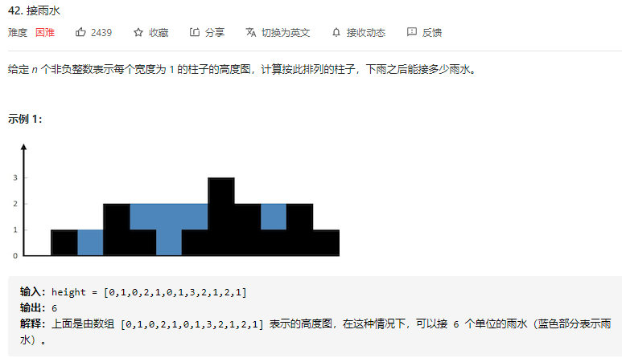
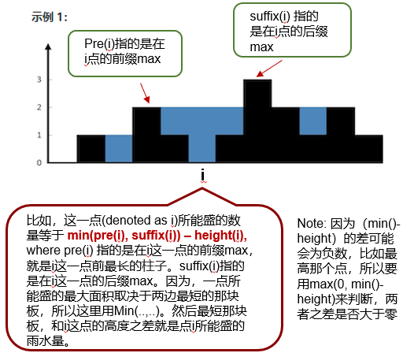
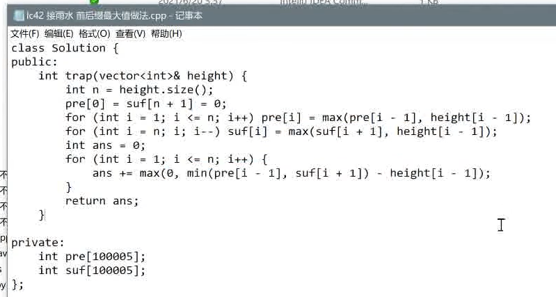
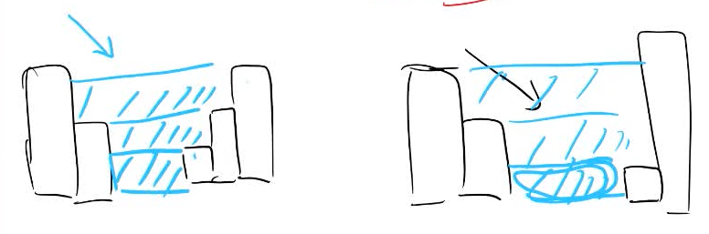

## 周一习题课

### 设计边长数组

```python
class List{
    List()
    push()
    pop()
    get(i) # ==》 Return ith element
}
```

**Assumption**

- 理论上空间上可以push无数多个element

- 设计题一定要多喝面试管沟通, 把面试管假设成你的用户, 比如:

1. when List() being initialized， should we allocate  a constant size of static space for it? 
2. 一开始 list 为empty, then get(3) is being called, so should we fill out all 0 before it? or return some error code?

### 42. 接雨水

**Question：**



**Idea:**

- 能接的雨水量取决于，前缀max and后缀max的最小值，即min(前缀max，后缀max)



**Python Code:**


**C++ code:**

解法一：前后缀max



解法二：单调栈




### 邻值查找

- 136. 邻值查找, https://www.acwing.com/problem/content/description/138/

Question:

Idea：

Code:

```c++
#include <bits/stdc++.h>
using namespace std;

struct Node {
    int val, idx;
    Node* pre; Node* next;
} head, tail;
int a[100005], rk[100005], ans[100005], n;
Node* pos[100005];

// 双链表，新建节点的操作模板
Node* AddNode(Node* p, int idx) {
    Node* q = new Node();
    q->idx = idx, q->val = a[idx];
    q->pre = p, q->next = p->next;
    p->next->pre = q, p->next = q;
    return q;
}

// 双链表，删除节点的操作模板
void DeleteNode(Node* p) {
    p->pre->next = p->next;
    p->next->pre = p->pre;
    delete p;
}

int main() {
    cin >> n;
    for (int i = 1; i <= n; i++) {
        scanf("%d", &a[i]);
        rk[i] = i;
    }
    // rank，每个结点的大小排名
    sort(rk + 1, rk + n + 1, [&a](int i, int j) { return a[i] < a[j]; });
    // 双链表，初始化两个保护节点
    head.val = a[rk[1]] - 1e9;
    tail.val = a[rk[n]] + 1e9;
    head.next = &tail;
    tail.pre = &head;
    for (int i = 1; i <= n; i++) {
        pos[rk[i]] = AddNode(tail.pre, rk[i]);
    }
    for (int i = n; i > 1; i--) {
        Node* pre = pos[i]->pre;
        Node* next = pos[i]->next;
        if (a[i] - pre->val < next->val - a[i] ||
            a[i] - pre->val == next->val - a[i] && pre->val < next->val) {
            ans[i] = pre->idx;    
        } else {
            ans[i] = next->idx;
        }
        DeleteNode(pos[i]);
    }
    for (int i = 2; i <= n; i++) printf("%d %d\n", abs(a[i] - a[ans[i]]), ans[i]);
}
```


